# Diagram przepływu autentykacji - ShopMate

**Data utworzenia:** 2025-01-25
**Źródła:**
- `.ai/doc/4_prd.md` (PRD - Product Requirements Document)
- `.ai/doc/31_1_auth-spec.md` (Specyfikacja architektury autentykacji)

---

## Przegląd

Diagram przedstawia szczegółowe przepływy autentykacji w aplikacji ShopMate MVP, obejmujące:

1. **Rejestrację użytkownika** (US-001, FR-012)
2. **Logowanie użytkownika** (US-002, FR-013)
3. **Ochronę tras przez Middleware** (US-005, FR-016)
4. **Reset hasła** - część 1 i 2 (US-003, FR-014)
5. **Wylogowanie** (US-004, FR-015)
6. **Automatyczne odświeżanie tokenu**
7. **Row Level Security (RLS)**

---

## Aktorzy

| Aktor | Opis |
|-------|------|
| **Przeglądarka** | Interfejs użytkownika (React komponenty w Astro) |
| **Middleware** | Astro middleware - server-side sprawdzanie sesji przed renderowaniem stron |
| **Astro Frontend** | Strony Astro (SSR) + komponenty React |
| **Supabase Auth** | Zewnętrzna usługa autentykacji - zarządza użytkownikami, sesjami, JWT tokens |
| **PostgreSQL** | Baza danych Supabase - przechowuje dane użytkowników (auth.users) i aplikacji |

---

## Technologie

- **Frontend:** Astro 5 (SSR mode) + React 18 + TypeScript 5
- **Auth:** Supabase Auth (email + hasło)
- **Sesja:** httpOnly cookies (sb-access-token, sb-refresh-token)
- **Security:** HTTPS, RLS policies, bcrypt hashing
- **Walidacja:** Zod schemas (client-side i server-side)

---

## Diagram Mermaid

```mermaid
sequenceDiagram
    autonumber

    participant U as Przeglądarka
    participant M as Middleware
    participant A as Astro Frontend
    participant S as Supabase Auth
    participant DB as PostgreSQL

    Note over U,DB: PRZEPŁYW 1: REJESTRACJA UŻYTKOWNIKA

    U->>A: Otwarcie strony /register
    activate A
    A->>M: Sprawdzenie sesji użytkownika
    activate M
    M->>S: getSession()
    S-->>M: Brak sesji
    M-->>A: Renderuj stronę rejestracji
    deactivate M
    A-->>U: Formularz rejestracji
    deactivate A

    U->>U: Wypełnienie formularza<br/>(email, hasło, potwierdzenie)
    U->>A: Submit formularza
    activate A
    A->>A: Walidacja Zod (client-side)

    alt Walidacja nieudana
        A-->>U: Wyświetl błędy inline
    else Walidacja udana
        A->>S: signUp(email, password)
        activate S
        S->>S: Walidacja formatu email
        S->>DB: Sprawdzenie czy email istnieje
        activate DB
        DB-->>S: Odpowiedź
        deactivate DB

        alt Email już istnieje
            S-->>A: Błąd: email_exists
            A-->>U: Toast: Konto już istnieje
        else Email nowy
            S->>S: Hashowanie hasła (bcrypt)
            S->>DB: Zapis do auth.users
            activate DB
            DB-->>S: User created
            deactivate DB
            S->>S: Generowanie JWT tokens<br/>(access + refresh)
            S->>S: Zapis sesji w cookies<br/>(httpOnly, Secure, SameSite)
            S-->>A: Sukces + session
            deactivate S
            A-->>U: Toast: Witaj w ShopMate!
            A->>U: Redirect do /dashboard
        end
    end
    deactivate A

    Note over U,DB: PRZEPŁYW 2: LOGOWANIE UŻYTKOWNIKA

    U->>A: Próba wejścia na /calendar
    activate A
    A->>M: Sprawdzenie sesji
    activate M
    M->>S: getSession()
    S-->>M: Brak sesji
    M-->>A: Redirect do /login?redirect=/calendar
    deactivate M
    A-->>U: Formularz logowania
    deactivate A

    U->>U: Wypełnienie formularza<br/>(email, hasło)
    U->>A: Submit formularza
    activate A
    A->>A: Walidacja Zod
    A->>S: signInWithPassword(email, password)
    activate S
    S->>DB: Query auth.users WHERE email
    activate DB
    DB-->>S: User data
    deactivate DB
    S->>S: Weryfikacja hasła (bcrypt compare)

    alt Credentials niepoprawne
        S-->>A: Błąd: invalid_credentials
        A-->>U: Toast: Nieprawidłowy email lub hasło
    else Credentials poprawne
        S->>S: Generowanie nowych JWT tokens
        S->>S: Zapis sesji w cookies
        S->>DB: Update last_sign_in_at
        activate DB
        DB-->>S: Updated
        deactivate DB
        S-->>A: Sukces + session
        deactivate S
        A-->>U: Redirect do /calendar
    end
    deactivate A

    Note over U,DB: PRZEPŁYW 3: OCHRONA TRAS (MIDDLEWARE)

    U->>M: Request do /dashboard
    activate M
    M->>S: getSession()
    activate S
    S->>S: Odczyt cookies<br/>(sb-access-token)
    S->>S: Weryfikacja JWT signature

    alt Token ważny
        S-->>M: Session valid + user data
        M-->>A: Renderuj stronę /dashboard
        activate A
        A-->>U: Wyświetl dashboard
        deactivate A
    else Token nieważny lub brak
        S-->>M: Brak sesji
        deactivate S
        M-->>U: Redirect do<br/>/login?redirect=/dashboard
    end
    deactivate M

    Note over U,DB: PRZEPŁYW 4: RESET HASŁA (część 1)

    U->>A: Otwarcie /reset-password
    activate A
    A-->>U: Formularz z polem email
    deactivate A

    U->>A: Submit email
    activate A
    A->>S: resetPasswordForEmail(email)
    activate S
    S->>DB: Sprawdzenie czy email istnieje
    activate DB
    DB-->>S: User exists (lub nie)
    deactivate DB
    S->>S: Generowanie unique token<br/>(ważny 24h)

    Note over S: Równoległe akcje
    S->>S: Wysłanie email z linkiem<br/>/reset-password?access_token=XXX
    S-->>A: Sukces (zawsze, security)
    deactivate S
    A-->>U: Toast: Link wysłany na email
    deactivate A

    Note over U,DB: PRZEPŁYW 4: RESET HASŁA (część 2)

    U->>A: Kliknięcie linku w emailu<br/>(/reset-password?access_token=XXX)
    activate A
    A->>M: Sprawdzenie parametrów URL
    activate M
    M->>M: Wykrycie type=recovery
    M-->>A: isResetCallback=true
    deactivate M
    A-->>U: Formularz nowego hasła
    deactivate A

    U->>U: Wpisanie nowego hasła
    U->>A: Submit nowego hasła
    activate A
    A->>S: updateUser(password: newPassword)
    activate S
    S->>S: Weryfikacja access_token

    alt Token wygasł (>24h)
        S-->>A: Błąd: token_expired
        A-->>U: Toast: Link wygasł
    else Token ważny
        S->>S: Hashowanie nowego hasła
        S->>DB: Update auth.users SET password
        activate DB
        DB-->>S: Password updated
        deactivate DB
        S->>S: Invalidacja starego tokenu
        S-->>A: Sukces
        deactivate S
        A-->>U: Toast: Hasło zmienione
        A->>U: Redirect do /login
    end
    deactivate A

    Note over U,DB: PRZEPŁYW 5: WYLOGOWANIE

    U->>A: Kliknięcie przycisku Wyloguj
    activate A
    A->>S: signOut()
    activate S
    S->>DB: Usunięcie sesji z auth.sessions
    activate DB
    DB-->>S: Session deleted
    deactivate DB
    S->>S: Invalidacja JWT tokens
    S->>S: Usunięcie cookies
    S-->>A: Sukces
    deactivate S
    A-->>U: Toast: Zostałeś wylogowany
    A->>U: Redirect do /login
    deactivate A

    Note over U,DB: PRZEPŁYW 6: ODŚWIEŻANIE TOKENU

    U->>M: Request do chronionej strony
    activate M
    M->>S: getSession()
    activate S
    S->>S: Sprawdzenie access token

    alt Access token wygasł
        S->>S: Odczyt refresh token z cookies
        S->>DB: Weryfikacja refresh token
        activate DB
        DB-->>S: Refresh token valid
        deactivate DB
        S->>S: Generowanie nowego access token
        S->>S: Update cookies
        S-->>M: Session valid + nowy token
    else Access token ważny
        S-->>M: Session valid
    end
    deactivate S
    M-->>A: Renderuj stronę
    activate A
    A-->>U: Wyświetl zawartość
    deactivate A
    deactivate M

    Note over U,DB: PRZEPŁYW 7: ROW LEVEL SECURITY

    U->>A: Request do /api/recipes
    activate A
    A->>M: Sprawdzenie sesji
    activate M
    M->>S: getSession()
    S-->>M: Session + user_id
    M-->>A: Session valid
    deactivate M
    A->>DB: SELECT * FROM recipes<br/>WHERE auth.uid() = user_id
    activate DB
    DB->>DB: RLS Policy: sprawdzenie auth.uid()
    DB-->>A: Tylko przepisy użytkownika
    deactivate DB
    A-->>U: Wyświetl przepisy
    deactivate A
```



---

## Kluczowe elementy bezpieczeństwa

### 1. Zarządzanie sesją

**JWT Tokens:**
- **Access token:** krótkoterminowy (~1h), przechowywany w httpOnly cookie
- **Refresh token:** długoterminowy (~30 dni), przechowywany w httpOnly cookie

**Automatyczne odświeżanie:**
- Supabase automatycznie odświeża access token gdy wygasa
- Jeśli refresh token wygasł → użytkownik musi się zalogować ponownie

### 2. Ochrona cookies

- **httpOnly:** cookies niedostępne przez JavaScript → ochrona przed XSS
- **Secure:** cookies tylko przez HTTPS → ochrona przed MITM
- **SameSite=Lax:** ochrona przed CSRF

### 3. Row Level Security (RLS)

**Zasada działania:**
```sql
-- Przykład RLS policy dla recipes
CREATE POLICY "Users can view own recipes"
  ON recipes
  FOR SELECT
  USING (auth.uid() = user_id);
```

- Każde zapytanie do bazy automatycznie filtrowane przez RLS
- `auth.uid()` zwraca user_id z JWT tokenu
- Brak sesji → `auth.uid() = NULL` → 0 wyników
- Użytkownik A nie widzi danych użytkownika B

### 4. Middleware - ochrona tras

**Chronione trasy:**
- `/dashboard`
- `/recipes`
- `/calendar`
- `/shopping-lists`

**Publiczne trasy:**
- `/` (landing page)
- `/login`
- `/register`
- `/reset-password`

**Flow ochrony:**
1. Request do chronionej trasy
2. Middleware sprawdza sesję (getSession())
3. Brak sesji → redirect do `/login?redirect=/original-path`
4. Po zalogowaniu → redirect do oryginalnej trasy

---

## Scenariusze brzegowe (Edge Cases)

### Rejestracja:
- ✅ Email już istnieje → Toast: "Konto z tym adresem email już istnieje"
- ✅ Słabe hasło → Walidacja Zod: inline errors
- ✅ Network error → Toast: "Brak połączenia. Sprawdź internet..."

### Logowanie:
- ✅ Nieprawidłowe credentials → Toast: "Nieprawidłowy email lub hasło" (ten sam komunikat dla obu przypadków - security)
- ✅ Użytkownik już zalogowany → Middleware redirect do /dashboard

### Reset hasła:
- ✅ Email nie istnieje → Supabase wysyła komunikat sukcesu (security: nie ujawniamy czy email istnieje)
- ✅ Link wygasł (>24h) → Toast: "Link resetujący wygasł. Poproś o nowy."

### Token refresh:
- ✅ Access token wygasł → Auto-refresh z refresh token
- ✅ Refresh token wygasł → Redirect do /login

---

## Walidacja (Zod schemas)

**Email schema:**
```typescript
const emailSchema = z
  .string()
  .trim()
  .toLowerCase()
  .email('Nieprawidłowy format adresu email');
```

**Password schema:**
```typescript
const passwordSchema = z
  .string()
  .min(8, 'Hasło musi mieć minimum 8 znaków')
  .max(100, 'Hasło może mieć maksimum 100 znaków')
  .regex(/[A-Z]/, 'Hasło musi zawierać minimum 1 wielką literę')
  .regex(/[0-9]/, 'Hasło musi zawierać minimum 1 cyfrę');
```

**Register schema:**
```typescript
export const registerSchema = z
  .object({
    email: emailSchema,
    password: passwordSchema,
    confirmPassword: z.string(),
  })
  .refine((data) => data.password === data.confirmPassword, {
    message: 'Hasła nie są identyczne',
    path: ['confirmPassword'],
  });
```

---

## Komunikaty błędów (język polski)

| Błąd | Komunikat |
|------|-----------|
| `invalid_credentials` | "Nieprawidłowy email lub hasło" |
| `email_exists` | "Konto z tym adresem email już istnieje" |
| `weak_password` | "Hasło jest zbyt słabe" |
| `invalid_email` | "Nieprawidłowy adres email" |
| `user_not_found` | "Nie znaleziono użytkownika o tym adresie email" |
| `token_expired` | "Link resetujący wygasł. Poproś o nowy." |
| Network error | "Brak połączenia. Sprawdź internet i spróbuj ponownie." |
| Other errors | "Coś poszło nie tak. Spróbuj ponownie za chwilę." |

---

## Zgodność z wymaganiami

| Wymaganie | Status | Diagram |
|-----------|--------|---------|
| **US-001** Rejestracja użytkownika | ✅ Covered | Przepływ 1 |
| **US-002** Logowanie użytkownika | ✅ Covered | Przepływ 2 |
| **US-003** Reset hasła | ✅ Covered | Przepływ 4 (część 1 i 2) |
| **US-004** Wylogowanie | ✅ Covered | Przepływ 5 |
| **US-005** Ochrona tras | ✅ Covered | Przepływ 3 |
| **FR-012** Rejestracja (walidacja, Supabase) | ✅ Covered | Przepływ 1 |
| **FR-013** Logowanie (przekierowania) | ✅ Covered | Przepływ 2 |
| **FR-014** Reset hasła (email + link) | ✅ Covered | Przepływ 4 |
| **FR-015** Wylogowanie (cookies) | ✅ Covered | Przepływ 5 |
| **FR-016** Middleware (route guards) | ✅ Covered | Przepływ 3 |
| Token refresh | ✅ Covered | Przepływ 6 |
| Row Level Security | ✅ Covered | Przepływ 7 |

---

## Następne kroki implementacji

1. **Utworzenie plików:**
   - `src/layouts/AuthLayout.astro`
   - `src/pages/login.astro`
   - `src/pages/register.astro`
   - `src/pages/reset-password.astro`
   - `src/components/auth/LoginView.tsx`
   - `src/components/auth/RegisterView.tsx`
   - `src/components/auth/ResetPasswordView.tsx`
   - `src/components/Navigation.tsx`
   - `src/middleware/index.ts`
   - `src/lib/validation/auth.schema.ts`
   - `src/lib/utils/auth-errors.ts`

2. **Modyfikacje:**
   - `src/layouts/Layout.astro` - dodanie `<Navigation />`
   - `src/pages/index.astro` - dodanie CTA do `/register`
   - `src/env.d.ts` - type definitions dla `locals.supabase`

3. **Konfiguracja Supabase:**
   - Email Templates (reset password)
   - Redirect URLs
   - RLS policies (migracja SQL)

4. **Testing:**
   - Manual testing: rejestracja, logowanie, reset hasła, wylogowanie
   - Middleware: ochrona tras
   - RLS: izolacja danych użytkowników
   - Accessibility: keyboard navigation, ARIA labels
   - Performance: Lighthouse score ≥90/100

---

**Dokument utworzony automatycznie na podstawie:**
- `.ai/doc/4_prd.md` - Product Requirements Document
- `.ai/doc/31_1_auth-spec.md` - Specyfikacja architektury autentykacji
- `.ai/prompts/31_4_mermaid-diagram-auth.mdc` - Reguły tworzenia diagramów

**Wersja:** 1.0
**Data:** 2025-01-25