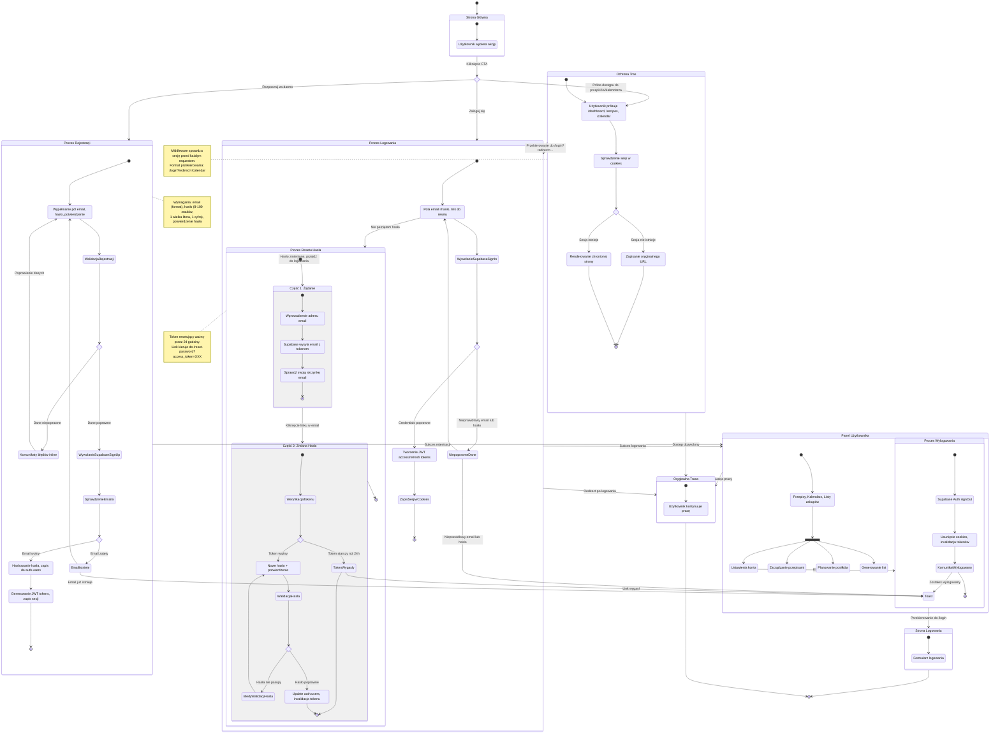

# Diagram User Journey - Moduł Autentykacji ShopMate

## Opis

Diagram przedstawia podróż użytkownika przez system autentykacji aplikacji ShopMate, obejmując:
- Rejestrację nowych użytkowników
- Logowanie istniejących użytkowników
- Reset i odzyskiwanie hasła
- Wylogowanie
- Ochronę tras przed nieautoryzowanym dostępem

Diagram został utworzony w oparciu o:
- Dokument PRD (4_prd.md) - Historie użytkownika US-001 do US-005
- Specyfikację architektury autentykacji (31_1_auth-spec.md)
- Wytyczne dotyczące User Journey

## Mermaid Diagram

## Legenda

### Elementy diagramu

- **StronaGlowna**: Landing page z CTA do rejestracji/logowania
- **Rejestracja**: Proces tworzenia nowego konta
- **Logowanie**: Proces uwierzytelniania istniejącego użytkownika
- **ResetHasla**: Dwuetapowy proces odzyskiwania hasła
- **OchronaTras**: Middleware sprawdzający sesję przed dostępem do chronionych tras
- **Dashboard**: Główny panel zalogowanego użytkownika
- **Wylogowanie**: Zakończenie sesji użytkownika

### Punkty decyzyjne (choice)

- **wybor_akcji**: Użytkownik wybiera rejestrację lub logowanie
- **walidacja_rejestracji**: Sprawdzenie poprawności danych rejestracyjnych
- **sprawdzenie_email**: Weryfikacja czy email już istnieje w systemie
- **weryfikacja_credentials**: Sprawdzenie poprawności email + hasło
- **weryfikacja_token**: Sprawdzenie ważności tokenu resetującego
- **walidacja_hasla**: Weryfikacja nowego hasła
- **sprawdzenie_sesji**: Middleware sprawdza czy użytkownik jest zalogowany

### Stany równoległe (fork)

- **nawigacja**: Użytkownik może nawigować między różnymi sekcjami dashboard

## Mapowanie na User Stories

- **US-001**: Ścieżka przez stan "Proces Rejestracji"
- **US-002**: Ścieżka przez stan "Proces Logowania"
- **US-003**: Ścieżka przez stan "Proces Resetu Hasła"
- **US-004**: Ścieżka przez stan "Proces Wylogowania"
- **US-005**: Ścieżka przez stan "Ochrona Tras"

## Kluczowe obserwacje

1. **Automatyczne logowanie po rejestracji**: Użytkownik nie musi się logować po utworzeniu konta - Supabase automatycznie tworzy sesję.

2. **Security przez design**:
   - Komunikaty błędów nie ujawniają czy email istnieje ("Nieprawidłowy email lub hasło")
   - Token resetujący ważny tylko 24 godziny
   - httpOnly cookies chroniące przed XSS

3. **Redirect pattern**: Middleware zapisuje oryginalną trasę i przekierowuje użytkownika po zalogowaniu do miejsca, gdzie próbował się dostać.

4. **Walidacja dwuetapowa**:
   - Client-side: Zod schemas z komunikatami inline
   - Server-side: Supabase Auth z fallback na polskie komunikaty

5. **Optimistic UI**: Użytkownik widzi natychmiastowy feedback, rollback przy błędach API.
