# Diagram Architektury UI - Moduł Autentykacji ShopMate

## Przegląd

Diagram przedstawia architekturę interfejsu użytkownika dla modułu autentykacji w aplikacji ShopMate MVP. Wizualizuje przepływ danych między komponentami, zależności oraz integrację z istniejącymi elementami systemu.

## Legenda

- **Zielone węzły** - Nowe komponenty do utworzenia
- **Żółte węzły** - Komponenty wymagające modyfikacji
- **Niebieskie węzły** - Istniejące komponenty (bez zmian)
- **Fioletowe węzły** - Zewnętrzne usługi (Supabase Auth)
- **Różowe węzły** - Warstwa bazodanowa

## Diagram

```mermaid
flowchart TD
    %% Style definitions
    classDef newComponent fill:#e1f5e1,stroke:#4caf50,stroke-width:2px
    classDef modifiedComponent fill:#fff3cd,stroke:#ff9800,stroke-width:2px
    classDef existingComponent fill:#e3f2fd,stroke:#2196f3,stroke-width:1px
    classDef externalService fill:#f3e5f5,stroke:#9c27b0,stroke-width:2px
    classDef database fill:#fce4ec,stroke:#e91e63,stroke-width:2px

    %% Main user entry points
    User([Użytkownik])

    %% New Authentication Pages
    subgraph NewPages["Nowe Strony Autentykacji"]
        LoginPage["login.astro<br/>(NOWY)"]:::newComponent
        RegisterPage["register.astro<br/>(NOWY)"]:::newComponent
        ResetPage["reset-password.astro<br/>(NOWY)"]:::newComponent
    end

    %% Modified Pages
    subgraph ModifiedPages["Zmodyfikowane Strony"]
        LandingPage["index.astro<br/>(MODYFIKACJA)"]:::modifiedComponent
        LayoutMain["Layout.astro<br/>(MODYFIKACJA)"]:::modifiedComponent
    end

    %% New Layout
    subgraph NewLayouts["Nowe Layouts"]
        AuthLayout["AuthLayout.astro<br/>(NOWY)"]:::newComponent
    end

    %% New Auth Components
    subgraph AuthComponents["Nowe Komponenty Auth (React)"]
        LoginView["LoginView.tsx<br/>(NOWY)"]:::newComponent
        RegisterView["RegisterView.tsx<br/>(NOWY)"]:::newComponent
        ResetView["ResetPasswordView.tsx<br/>(NOWY)"]:::newComponent
        Navigation["Navigation.tsx<br/>(NOWY)"]:::newComponent
    end

    %% Middleware
    subgraph MiddlewareLayer["Middleware (Rozszerzony)"]
        Middleware["middleware/index.ts<br/>(MODYFIKACJA)<br/>- Sprawdzanie sesji<br/>- Ochrona tras<br/>- Redirect logic"]:::modifiedComponent
    end

    %% Validation & Utils
    subgraph ValidationLayer["Walidacja i Utility (Nowe)"]
        AuthSchema["auth.schema.ts<br/>(NOWY)<br/>Zod schemas"]:::newComponent
        AuthErrors["auth-errors.ts<br/>(NOWY)<br/>Mapowanie błędów"]:::newComponent
    end

    %% Existing Protected Pages
    subgraph ProtectedPages["Istniejące Chronione Strony"]
        Dashboard["dashboard.astro"]:::existingComponent
        Calendar["calendar.astro"]:::existingComponent
        Recipes["recipes/index.astro"]:::existingComponent
        ShoppingLists["shopping-lists/index.astro"]:::existingComponent
    end

    %% Existing Components
    subgraph ExistingComponents["Istniejące Komponenty (React)"]
        DashboardView["DashboardView.tsx"]:::existingComponent
        RecipesView["RecipesListView.tsx"]:::existingComponent
        CalendarComp["Calendar.tsx"]:::existingComponent
        ShoppingView["ShoppingListsHistoryView.tsx"]:::existingComponent
    end

    %% Supabase Integration
    subgraph SupabaseLayer["Integracja Supabase"]
        SupabaseClient["supabase.client.ts<br/>(istniejący)"]:::existingComponent
        SupabaseAuth["Supabase Auth Service<br/>- signUp()<br/>- signInWithPassword()<br/>- signOut()<br/>- resetPasswordForEmail()<br/>- updateUser()"]:::externalService
    end

    %% Database
    subgraph DatabaseLayer["Baza Danych"]
        AuthUsers["auth.users<br/>(Supabase)"]:::database
        AppTables["recipes, meal_plan,<br/>shopping_lists<br/>(RLS policies)"]:::database
    end

    %% Session Management
    Cookies["HTTP Cookies<br/>(httpOnly)<br/>- access_token<br/>- refresh_token"]:::externalService

    %% Flow connections - User to Pages
    User -->|"1. Wejście na /"| LandingPage
    User -->|"2. Wejście /login"| LoginPage
    User -->|"3. Wejście /register"| RegisterPage
    User -->|"4. Próba /dashboard"| Middleware
    User -->|"5. Reset hasła"| ResetPage

    %% Landing Page Flow
    LandingPage -->|"CTA: Zaloguj/Zarejestruj"| LoginPage
    LandingPage -->|"CTA: Zarejestruj"| RegisterPage

    %% Auth Pages to Layout
    LoginPage -->|"Używa"| AuthLayout
    RegisterPage -->|"Używa"| AuthLayout
    ResetPage -->|"Używa"| AuthLayout

    %% Layout to Components
    AuthLayout -->|"Renderuje"| LoginView
    AuthLayout -->|"Renderuje"| RegisterView
    AuthLayout -->|"Renderuje"| ResetView

    %% Auth Components to Validation
    LoginView -->|"Walidacja"| AuthSchema
    RegisterView -->|"Walidacja"| AuthSchema
    ResetView -->|"Walidacja"| AuthSchema

    %% Auth Components to Supabase
    LoginView -->|"signInWithPassword()"| SupabaseClient
    RegisterView -->|"signUp()"| SupabaseClient
    ResetView -->|"resetPasswordForEmail()<br/>updateUser()"| SupabaseClient

    %% Supabase Client to Auth Service
    SupabaseClient -->|"API calls"| SupabaseAuth

    %% Error Handling
    SupabaseClient -->|"Błędy"| AuthErrors
    AuthErrors -->|"Polskie komunikaty"| LoginView
    AuthErrors -->|"Polskie komunikaty"| RegisterView
    AuthErrors -->|"Polskie komunikaty"| ResetView

    %% Auth Service to Database
    SupabaseAuth -->|"Zarządza"| AuthUsers
    SupabaseAuth -->|"Generuje"| Cookies

    %% Middleware Flow
    Middleware -->|"Odczyt sesji"| Cookies
    Middleware -->|"getSession()"| SupabaseClient
    Middleware -->|"Brak sesji"| LoginPage
    Middleware -->|"Sesja OK"| ProtectedPages

    %% Protected Pages to Layout
    Dashboard -->|"Używa"| LayoutMain
    Calendar -->|"Używa"| LayoutMain
    Recipes -->|"Używa"| LayoutMain
    ShoppingLists -->|"Używa"| LayoutMain

    %% Layout to Navigation
    LayoutMain -->|"Zawiera"| Navigation

    %% Navigation to Supabase
    Navigation -->|"signOut()"| SupabaseClient
    Navigation -.->|"Po wylogowaniu"| LoginPage

    %% Protected Pages to Components
    Dashboard -->|"Renderuje"| DashboardView
    Recipes -->|"Renderuje"| RecipesView
    Calendar -->|"Renderuje"| CalendarComp
    ShoppingLists -->|"Renderuje"| ShoppingView

    %% RLS Connection
    AuthUsers -->|"user_id reference"| AppTables

    %% Success Redirects
    LoginView -.->|"Sukces redirect"| Dashboard
    RegisterView -.->|"Sukces redirect"| Dashboard
    ResetView -.->|"Sukces redirect"| LoginPage
```



## Kluczowe przepływy

### 1. Rejestracja nowego użytkownika

```
Użytkownik → /register → RegisterPage (Astro)
  → AuthLayout → RegisterView (React)
  → Walidacja (auth.schema.ts)
  → supabase.signUp()
  → Supabase Auth → auth.users
  → Cookies (sesja)
  → Redirect /dashboard
```

### 2. Logowanie użytkownika

```
Użytkownik → /calendar (chronione)
  → Middleware → brak sesji
  → Redirect /login?redirect=/calendar
  → LoginPage → AuthLayout → LoginView
  → Walidacja → supabase.signInWithPassword()
  → Supabase Auth → Cookies
  → Redirect /calendar
```

### 3. Reset hasła

```
Użytkownik → /reset-password
  → ResetPage → AuthLayout → ResetPasswordView (tryb: request)
  → supabase.resetPasswordForEmail()
  → Email z linkiem
  → Klik link → /reset-password?access_token=XXX
  → ResetPasswordView (tryb: update)
  → supabase.updateUser()
  → Redirect /login
```

### 4. Wylogowanie

```
Użytkownik → Klik "Wyloguj" (Navigation)
  → supabase.signOut()
  → Usunięcie cookies
  → Redirect /login
```

### 5. Ochrona tras (Middleware)

```
Request → /dashboard
  → Middleware → getSession() (z cookies)
  → Jeśli brak sesji → Redirect /login?redirect=/dashboard
  → Jeśli sesja OK → Renderowanie dashboard.astro
```

## Komponenty do utworzenia

### Nowe strony Astro:

- `src/pages/login.astro`
- `src/pages/register.astro`
- `src/pages/reset-password.astro`

### Nowy layout:

- `src/layouts/AuthLayout.astro`

### Nowe komponenty React:

- `src/components/auth/LoginView.tsx`
- `src/components/auth/RegisterView.tsx`
- `src/components/auth/ResetPasswordView.tsx`
- `src/components/Navigation.tsx`

### Nowe pliki walidacji i utils:

- `src/lib/validation/auth.schema.ts`
- `src/lib/utils/auth-errors.ts`

## Komponenty do modyfikacji

### Modyfikacje istniejących plików:

- `src/middleware/index.ts` - rozszerzenie o sprawdzanie sesji i ochronę tras
- `src/layouts/Layout.astro` - dodanie komponentu Navigation
- `src/pages/index.astro` - dodanie CTA do rejestracji/logowania
- `src/env.d.ts` - type definitions dla locals.supabase

## Integracja z Supabase

### Supabase Auth Service:

- **signUp()** - rejestracja nowego użytkownika
- **signInWithPassword()** - logowanie użytkownika
- **signOut()** - wylogowanie użytkownika
- **resetPasswordForEmail()** - request reset hasła
- **updateUser()** - aktualizacja hasła
- **getSession()** - sprawdzanie sesji (middleware)

### Zarządzanie sesją:

- **Cookies (httpOnly):**
  - `sb-access-token` - JWT access token (~1h)
  - `sb-refresh-token` - JWT refresh token (~30 dni)
- **Automatyczny refresh** - Supabase refreshuje access token gdy wygasa

### Row Level Security (RLS):

- Tabele aplikacji (recipes, meal_plan, shopping_lists) używają `auth.uid()` w policies
- Pełna izolacja danych użytkowników
- Foreign key: `user_id REFERENCES auth.users(id) ON DELETE CASCADE`

## Walidacja i obsługa błędów

### Walidacja client-side (Zod):

- **Email:** format email, lowercase, trim
- **Hasło:** 8-100 znaków, min 1 wielka litera, min 1 cyfra
- **Potwierdzenie hasła:** musi być identyczne
- Komunikaty błędów inline pod polami (polski)

### Obsługa błędów Supabase:

- Mapowanie kodów błędów na polskie komunikaty (auth-errors.ts)
- Toast notifications dla błędów serwera
- User-friendly messages (bez ujawniania szczegółów technicznych)

## Bezpieczeństwo

- **httpOnly cookies** - zabezpieczenie przed XSS
- **HTTPS** - wymuszony przez Vercel
- **SameSite=Lax** - ochrona przed CSRF
- **RLS policies** - izolacja danych na poziomie bazy
- **Rate limiting** - Supabase default (100 req/min)
- **Password requirements** - zgodnie z US-001 (8+ chars, 1 uppercase, 1 digit)

## Przypisy

Diagram utworzony na podstawie:

- Dokumentu wymagań produktu (PRD) - `.ai/doc/4_prd.md`
- Specyfikacji architektury autentykacji - `.ai/doc/31_1_auth-spec.md`
- Reguł tworzenia diagramów Mermaid - `.ai/prompts/31_6_mermaid-diagram-ui.mdc`

Data utworzenia: 2025-11-25
Wersja: 1.0
Status: Draft - gotowy do review
