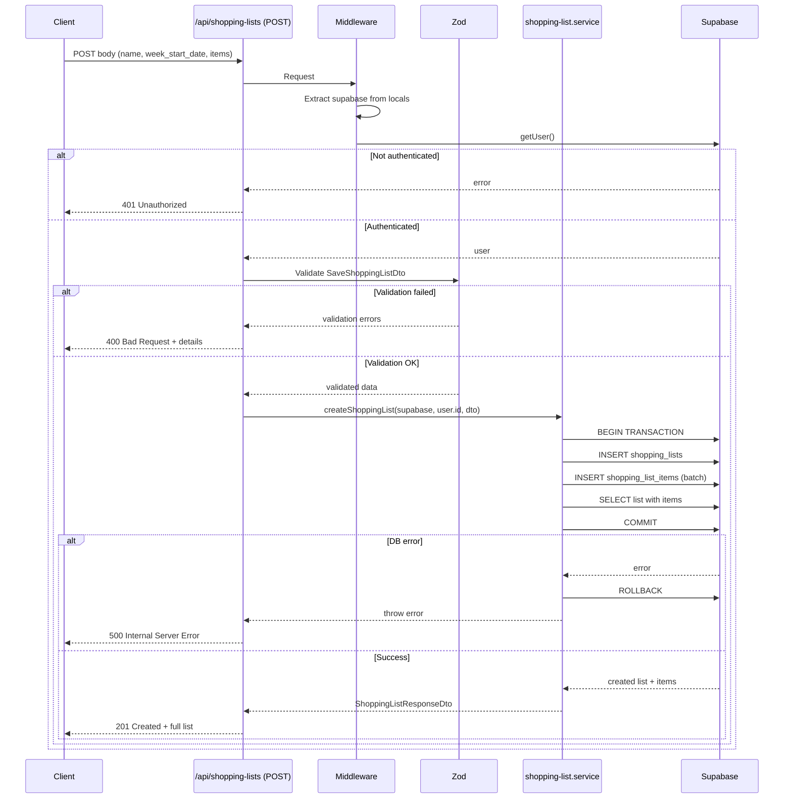
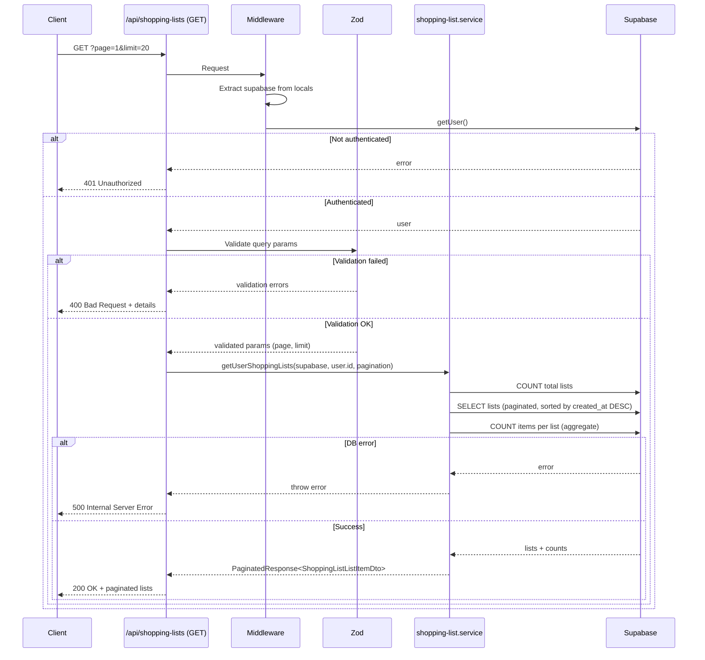

# API Endpoint Implementation Plan: Shopping Lists (POST & GET)

## 1. Przegląd punktów końcowych

### Endpoint 1: POST /api/shopping-lists
Zapisuje listę zakupów jako niezmiennego snapshota po edycji przez użytkownika w podglądzie. Implementuje snapshot pattern - zapisana lista NIE aktualizuje się przy późniejszych edycjach przepisów. Lista może pochodzić z dwóch źródeł:
- **Mode 1**: Z kalendarza posiłków (week_start_date wypełnione)
- **Mode 2**: Z wybranych przepisów (week_start_date = NULL)

### Endpoint 2: GET /api/shopping-lists
Pobiera historię zapisanych list zakupów użytkownika z paginacją. Zwraca uproszczone obiekty list (bez pełnej listy itemów) posortowane po dacie utworzenia (najnowsze najpierw).

---

## 2. Szczegóły żądania

### POST /api/shopping-lists

**Metoda HTTP:** `POST`

**Struktura URL:** `/api/shopping-lists`

**Headers:**
- `Content-Type: application/json`
- `Authorization: Bearer {access_token}` (automatycznie przez Supabase client)

**Request Body:**
```typescript
{
  name?: string;              // max 200 chars, default "Lista zakupów"
  week_start_date?: string | null;  // YYYY-MM-DD format, nullable
  items: Array<{
    ingredient_name: string;  // 1-100 chars, required
    quantity: number | null;  // > 0 or null, optional
    unit: string | null;      // max 50 chars, optional
    category: IngredientCategory;  // enum, required
    sort_order: number;       // >= 0, required
  }>;  // min 1, max 100 items
}
```

**Parametry:**
- Wymagane:
  - `items` (array): Lista składników do zapisania
    - `ingredient_name`: Nazwa składnika
    - `category`: Kategoria AI (jeden z: Nabiał, Warzywa, Owoce, Mięso, Pieczywo, Przyprawy, Inne)
    - `sort_order`: Kolejność sortowania w kategorii
- Opcjonalne:
  - `name`: Nazwa listy (jeśli brak, użyty zostanie default)
  - `week_start_date`: Data początku tygodnia (NULL dla list z trybu "Z przepisów")
  - `items[].quantity`: Ilość składnika (null jeśli nieznana)
  - `items[].unit`: Jednostka miary (null jeśli brak)

### GET /api/shopping-lists

**Metoda HTTP:** `GET`

**Struktura URL:** `/api/shopping-lists?page={page}&limit={limit}`

**Headers:**
- `Authorization: Bearer {access_token}` (automatycznie przez Supabase client)

**Query Parameters:**
- Opcjonalne:
  - `page` (number): Numer strony (default: 1, min: 1)
  - `limit` (number): Liczba elementów na stronę (default: 20, min: 1, max: 100)

---

## 3. Wykorzystywane typy

### Command Models (Input DTOs)

**SaveShoppingListDto** - już zdefiniowany w `src/types.ts:262-266`
```typescript
export interface SaveShoppingListDto {
  name: string;
  week_start_date: string | null;
  items: SaveShoppingListItemDto[];
}
```

**SaveShoppingListItemDto** - już zdefiniowany w `src/types.ts:250-256`
```typescript
export interface SaveShoppingListItemDto {
  ingredient_name: string;
  quantity: number | null;
  unit: string | null;
  category: IngredientCategory;
  sort_order: number;
}
```

**ShoppingListQueryParams** - już zdefiniowany w `src/types.ts:364`
```typescript
export type ShoppingListQueryParams = PaginationParams; // { page?: number; limit?: number; }
```

### Response DTOs

**ShoppingListResponseDto** - już zdefiniowany w `src/types.ts:278-280`
```typescript
export interface ShoppingListResponseDto extends ShoppingList {
  items: ShoppingListItemDto[];
}
```

**ShoppingListListItemDto** - już zdefiniowany w `src/types.ts:286-292`
```typescript
export interface ShoppingListListItemDto {
  id: string;
  name: string;
  week_start_date: string | null;
  items_count: number;
  created_at: string;
}
```

**PaginatedResponse** - już zdefiniowany w `src/types.ts:334-337`
```typescript
export interface PaginatedResponse<T> {
  data: T[];
  pagination: PaginationMetadata;
}
```

### Entity Types

**ShoppingList** - już zdefiniowany w `src/types.ts:28-30`
**ShoppingListItem** - już zdefiniowany in `src/types.ts:32-34`
**IngredientCategory** - już zdefiniowany in `src/types.ts:42-49`

### Error Response DTOs

**ErrorResponseDto** - już zdefiniowany w `src/types.ts:373-376`
**ValidationErrorResponseDto** - już zdefiniowany in `src/types.ts:386-389`

---

## 4. Szczegóły odpowiedzi

### POST /api/shopping-lists

**Status 201 Created:**
```json
{
  "id": "850e8400-e29b-41d4-a716-446655440000",
  "user_id": "123e4567-e89b-12d3-a456-426614174000",
  "name": "Lista zakupów - Tydzień 20-26 stycznia",
  "week_start_date": "2025-01-20",
  "created_at": "2025-01-26T14:00:00Z",
  "updated_at": "2025-01-26T14:00:00Z",
  "items": [
    {
      "id": "950e8400-e29b-41d4-a716-446655440000",
      "shopping_list_id": "850e8400-e29b-41d4-a716-446655440000",
      "ingredient_name": "spaghetti",
      "quantity": 1500,
      "unit": "g",
      "category": "Pieczywo",
      "is_checked": false,
      "sort_order": 0
    }
  ]
}
```

**Status 400 Bad Request:**
```json
{
  "error": "Validation failed",
  "details": {
    "name": ["Name must not exceed 200 characters"],
    "items": ["Maximum 100 items allowed"]
  }
}
```

**Status 401 Unauthorized:**
```json
{
  "error": "Unauthorized",
  "message": "You must be logged in to create a shopping list"
}
```

**Status 500 Internal Server Error:**
```json
{
  "error": "Internal server error",
  "message": "Failed to create shopping list"
}
```

### GET /api/shopping-lists

**Status 200 OK:**
```json
{
  "data": [
    {
      "id": "850e8400-e29b-41d4-a716-446655440000",
      "name": "Lista zakupów - Tydzień 20-26 stycznia",
      "week_start_date": "2025-01-20",
      "items_count": 23,
      "created_at": "2025-01-26T14:00:00Z"
    }
  ],
  "pagination": {
    "page": 1,
    "limit": 20,
    "total": 12,
    "total_pages": 1
  }
}
```

**Status 400 Bad Request:**
```json
{
  "error": "Validation failed",
  "details": {
    "page": ["Page must be at least 1"],
    "limit": ["Limit must not exceed 100"]
  }
}
```

**Status 401 Unauthorized:**
```json
{
  "error": "Unauthorized",
  "message": "You must be logged in to view shopping lists"
}
```

---

## 5. Przepływ danych

### POST /api/shopping-lists



### GET /api/shopping-lists



---

## 6. Względy bezpieczeństwa

### 1. Uwierzytelnianie (Authentication)
- **Wymaganie:** User MUSI być zalogowany (token JWT w Authorization header)
- **Implementacja:**
  ```typescript
  const { data: { user }, error } = await supabase.auth.getUser();
  if (error || !user) {
    return new Response(JSON.stringify({ error: "Unauthorized" }), { status: 401 });
  }
  ```
- **Lokalizacja:** Na początku każdego endpointu (POST i GET)

### 2. Autoryzacja (Authorization)
- **Row Level Security (RLS):** MUSI być włączone na tabelach
  - `shopping_lists`: Policy `auth.uid() = user_id` (SELECT, INSERT, DELETE)
  - `shopping_list_items`: Policy via shopping_lists ownership (CASCADE)
- **User Isolation:** Każdy user widzi TYLKO swoje listy
- **Weryfikacja:**
  ```sql
  -- RLS policy dla shopping_lists
  CREATE POLICY "Users can only access their own shopping lists"
  ON shopping_lists
  FOR ALL
  USING (auth.uid() = user_id);
  ```

### 3. Walidacja danych (Input Validation)
- **Zod schemas:** Ścisła walidacja wszystkich inputów
  - POST: `SaveShoppingListDto` schema
  - GET: `ShoppingListQueryParams` schema
- **Kontrole:**
  - Max długości stringów (name: 200, ingredient_name: 100, unit: 50)
  - Max liczby itemów (100)
  - Enum validation dla category (tylko 7 dozwolonych wartości)
  - Range validation (quantity > 0 lub null, sort_order >= 0)
  - Date format validation (YYYY-MM-DD regex dla week_start_date)
  - Pagination limits (page >= 1, limit 1-100)

### 4. SQL Injection Protection
- **Supabase Client:** Automatyczna ochrona przez prepared statements
- **Nie używać raw SQL queries:** Zawsze używać Supabase query builder

### 5. Mass Assignment Protection
- **DTO Mapping:** Tylko pola z DTO są mapowane do bazy
- **Blocked fields:** `id`, `created_at`, `updated_at` są auto-generowane przez bazę
- **User ID:** Zawsze brane z `auth.uid()`, NIGDY z request body

### 6. Rate Limiting
- **Supabase default:** 100 requests/minute (Free tier), 200 req/min (Pro)
- **Implementacja:** Handled by Supabase (no custom code needed for MVP)

### 7. Data Sanitization
- **Trim whitespace:** Na stringach (name, ingredient_name, unit)
- **Case preservation:** ingredient_name zachowuje oryginalne case
- **No HTML:** Brak potrzeby sanitizacji HTML (plain text only)

### 8. Error Information Disclosure
- **Nie ujawniać:** Stack traces, database schema details, internal errors
- **Generic messages:** "Internal server error" dla 500 errors
- **Specific messages:** Tylko dla validation errors (400) - bezpieczne

### 9. HTTPS Enforcement
- **Vercel:** Automatyczne HTTPS + SSL certificates
- **Cookies:** httpOnly, secure, sameSite (handled by Supabase Auth)

---

## 7. Obsługa błędów

### POST /api/shopping-lists

| Kod | Scenariusz | Response | Handling |
|-----|-----------|----------|----------|
| **201** | Sukces | Pełna lista z items | Return created list |
| **400** | Puste items array | `{ error: "Validation failed", details: { items: ["At least 1 item required"] } }` | Zod validation |
| **400** | Więcej niż 100 items | `{ error: "Validation failed", details: { items: ["Maximum 100 items allowed"] } }` | Zod validation |
| **400** | Nieprawidłowa category | `{ error: "Validation failed", details: { "items.0.category": ["Invalid category"] } }` | Zod enum validation |
| **400** | name > 200 chars | `{ error: "Validation failed", details: { name: ["Name must not exceed 200 characters"] } }` | Zod validation |
| **400** | ingredient_name puste | `{ error: "Validation failed", details: { "items.0.ingredient_name": ["Required"] } }` | Zod validation |
| **400** | ingredient_name > 100 chars | `{ error: "Validation failed", details: { "items.0.ingredient_name": ["Max 100 characters"] } }` | Zod validation |
| **400** | quantity <= 0 (gdy not null) | `{ error: "Validation failed", details: { "items.0.quantity": ["Must be positive"] } }` | Zod validation |
| **400** | Nieprawidłowy format week_start_date | `{ error: "Validation failed", details: { week_start_date: ["Invalid date format"] } }` | Zod regex validation |
| **400** | sort_order < 0 | `{ error: "Validation failed", details: { "items.0.sort_order": ["Must be non-negative"] } }` | Zod validation |
| **401** | Brak auth token | `{ error: "Unauthorized", message: "You must be logged in" }` | getUser() check |
| **401** | Nieprawidłowy token | `{ error: "Unauthorized", message: "Invalid authentication token" }` | getUser() error |
| **500** | Database error (insert failed) | `{ error: "Internal server error", message: "Failed to create shopping list" }` | Try-catch, rollback transaction |
| **500** | Transaction failed | `{ error: "Internal server error", message: "Failed to create shopping list" }` | Try-catch, rollback |
| **500** | Unexpected error | `{ error: "Internal server error" }` | Try-catch, log to Sentry |

### GET /api/shopping-lists

| Kod | Scenariusz | Response | Handling |
|-----|-----------|----------|----------|
| **200** | Sukces | Paginated lists | Return PaginatedResponse |
| **200** | Brak list (empty) | `{ data: [], pagination: {...} }` | Empty array, valid pagination |
| **400** | page < 1 | `{ error: "Validation failed", details: { page: ["Must be at least 1"] } }` | Zod validation |
| **400** | limit < 1 | `{ error: "Validation failed", details: { limit: ["Must be at least 1"] } }` | Zod validation |
| **400** | limit > 100 | `{ error: "Validation failed", details: { limit: ["Must not exceed 100"] } }` | Zod validation |
| **400** | Nieprawidłowy typ (page/limit not number) | `{ error: "Validation failed", details: { page: ["Expected number"] } }` | Zod validation |
| **401** | Brak auth token | `{ error: "Unauthorized", message: "You must be logged in" }` | getUser() check |
| **401** | Nieprawidłowy token | `{ error: "Unauthorized", message: "Invalid authentication token" }` | getUser() error |
| **500** | Database error (select failed) | `{ error: "Internal server error", message: "Failed to fetch shopping lists" }` | Try-catch, log to Sentry |
| **500** | Unexpected error | `{ error: "Internal server error" }` | Try-catch, log to Sentry |

### Error Logging Strategy

**Development:**
- Console.error() dla wszystkich błędów
- Stack traces w response (tylko dev)

**Production:**
- Sentry dla wszystkich 500 errors
- Sentry context: user_id, request body (sanitized), timestamp
- No stack traces w response
- Generic error messages

---

## 8. Rozważania dotyczące wydajności

### 1. Database Queries Optimization

**POST /api/shopping-lists:**
- **Transaction:** Użycie transakcji PostgreSQL (BEGIN/COMMIT)
- **Batch Insert:** Wszystkie items w jednym INSERT (nie loop)
  ```typescript
  // BAD: N queries
  for (const item of items) {
    await supabase.from('shopping_list_items').insert(item);
  }

  // GOOD: 1 query
  await supabase.from('shopping_list_items').insert(items);
  ```
- **Single SELECT:** Pobranie listy z items w jednym query (JOIN lub separate query with .select())
- **Indexes:** Upewnić się, że istnieją:
  - `shopping_lists.user_id` (B-tree) - dla RLS
  - `shopping_list_items.shopping_list_id` (B-tree) - dla JOIN

**GET /api/shopping-lists:**
- **Pagination:** LIMIT + OFFSET dla redukcji transferu danych
- **COUNT optimization:** Użyć `count: 'exact'` tylko gdy potrzebne
- **Aggregate queries:** COUNT items per list w jednym query (subquery lub GROUP BY)
- **Indexes:** Composite index na `(user_id, created_at DESC)` dla sortowania

### 2. N+1 Query Problem

**Problem:** Pobieranie itemów dla każdej listy osobno
**Solution:**
- POST: Pobierz listę z items w jednym query
  ```typescript
  const { data } = await supabase
    .from('shopping_lists')
    .select('*, shopping_list_items(*)')
    .eq('id', listId)
    .single();
  ```
- GET: Użyj aggregate query (COUNT) zamiast pobierania wszystkich items

### 3. Payload Size

**POST Request:**
- Max 100 items × ~150 bytes/item = ~15KB body
- Acceptable (no compression needed)

**POST Response:**
- Max 100 items × ~200 bytes/item = ~20KB response
- Acceptable dla MVP

**GET Response:**
- 20 items/page × ~100 bytes/item = ~2KB response
- Very light

### 4. Connection Pooling

**Supabase:** PgBouncer built-in (connection pooling automatic)
- **No custom pooling needed** dla MVP
- Monitor connection usage w Supabase dashboard

### 5. Caching Strategy

**POST:** Nie cachować (mutating operation)

**GET:**
- **Server-side:** Nie cachować dla MVP (dane real-time)
- **Client-side:** React Query z stale time (5 minutes)
  ```typescript
  useQuery(['shopping-lists', page], fetchLists, {
    staleTime: 5 * 60 * 1000, // 5 min
  });
  ```
- **HTTP Cache headers:** `Cache-Control: private, max-age=300` dla GET

### 6. Potential Bottlenecks

| Bottleneck | Impact | Mitigation |
|-----------|--------|-----------|
| **Large items array (100 items)** | Medium | Batch insert (1 query), frontend progress indicator |
| **High pagination (page 50+)** | Low | Use LIMIT/OFFSET, add cursor pagination post-MVP |
| **RLS policy evaluation** | Low dla MVP | Proper indexes, monitor query performance |
| **Concurrent writes** | Low | PostgreSQL handles ACID, transaction isolation |
| **Database size growth** | Low dla MVP | Archival strategy post-MVP (delete old lists) |

### 7. Performance Targets (MVP)

| Metric | Target | Measurement |
|--------|--------|-------------|
| **POST response time** | < 500ms (p95) | Vercel Analytics |
| **GET response time** | < 200ms (p95) | Vercel Analytics |
| **Database query time** | < 100ms (p95) | Supabase Dashboard |
| **Payload size** | < 50KB | Network tab |
| **Concurrent users** | 100 simultaneous requests | Load testing post-MVP |

---

## 9. Etapy wdrożenia

### Faza 1: Przygotowanie walidacji (30 min)

#### Krok 1.1: Sprawdź istniejące schematy Zod
```bash
# Sprawdź, czy istnieje plik z schematami shopping list
ls src/lib/validation/shopping-list.schema.ts
```

#### Krok 1.2: Utwórz lub zaktualizuj schematy Zod (jeśli nie istnieją)

**Lokalizacja:** `src/lib/validation/shopping-list.schema.ts`

```typescript
import { z } from "zod";
import { INGREDIENT_CATEGORIES } from "@/types";

// Regex dla daty YYYY-MM-DD
const dateRegex = /^\d{4}-\d{2}-\d{2}$/;

// Schema dla pojedynczego itemu
export const saveShoppingListItemSchema = z.object({
  ingredient_name: z
    .string()
    .trim()
    .min(1, "Ingredient name is required")
    .max(100, "Ingredient name must not exceed 100 characters"),

  quantity: z
    .number()
    .positive("Quantity must be positive")
    .nullable()
    .optional(),

  unit: z
    .string()
    .trim()
    .max(50, "Unit must not exceed 50 characters")
    .nullable()
    .optional(),

  category: z.enum(INGREDIENT_CATEGORIES, {
    errorMap: () => ({ message: "Invalid ingredient category" }),
  }),

  sort_order: z
    .number()
    .int("Sort order must be an integer")
    .min(0, "Sort order must be non-negative")
    .default(0),
});

// Schema dla zapisywania listy zakupów
export const saveShoppingListSchema = z.object({
  name: z
    .string()
    .trim()
    .max(200, "Name must not exceed 200 characters")
    .default("Lista zakupów"),

  week_start_date: z
    .string()
    .regex(dateRegex, "Invalid date format. Use YYYY-MM-DD")
    .nullable()
    .optional(),

  items: z
    .array(saveShoppingListItemSchema)
    .min(1, "At least 1 item is required")
    .max(100, "Maximum 100 items allowed"),
});

// Schema dla query params GET /api/shopping-lists
export const shoppingListQuerySchema = z.object({
  page: z
    .number()
    .int("Page must be an integer")
    .min(1, "Page must be at least 1")
    .default(1),

  limit: z
    .number()
    .int("Limit must be an integer")
    .min(1, "Limit must be at least 1")
    .max(100, "Limit must not exceed 100")
    .default(20),
});

// Type inference
export type SaveShoppingListInput = z.infer<typeof saveShoppingListSchema>;
export type ShoppingListQueryInput = z.infer<typeof shoppingListQuerySchema>;
```

#### Krok 1.3: Dodaj testy dla schematów (opcjonalnie, post-MVP)
**Lokalizacja:** `src/lib/validation/__tests__/shopping-list.schema.test.ts`

---

### Faza 2: Service Layer (1-1.5h)

#### Krok 2.1: Utwórz shopping-list.service.ts

**Lokalizacja:** `src/lib/services/shopping-list.service.ts`

```typescript
import type { SupabaseClient } from "@/db/supabase.client";
import type {
  SaveShoppingListDto,
  ShoppingListResponseDto,
  ShoppingListListItemDto,
  PaginatedResponse,
  PaginationMetadata,
} from "@/types";

/**
 * Create a new shopping list with items (snapshot pattern)
 * Uses transaction to ensure atomicity
 */
export async function createShoppingList(
  supabase: SupabaseClient,
  userId: string,
  dto: SaveShoppingListDto
): Promise<ShoppingListResponseDto> {
  // Step 1: Insert shopping list
  const { data: list, error: listError } = await supabase
    .from("shopping_lists")
    .insert({
      user_id: userId,
      name: dto.name || "Lista zakupów",
      week_start_date: dto.week_start_date || null,
    })
    .select()
    .single();

  if (listError) {
    throw new Error(`Failed to create shopping list: ${listError.message}`);
  }

  // Step 2: Insert shopping list items (batch)
  const itemsToInsert = dto.items.map((item) => ({
    shopping_list_id: list.id,
    ingredient_name: item.ingredient_name,
    quantity: item.quantity ?? null,
    unit: item.unit ?? null,
    category: item.category,
    sort_order: item.sort_order,
    is_checked: false, // Default value
  }));

  const { data: items, error: itemsError } = await supabase
    .from("shopping_list_items")
    .insert(itemsToInsert)
    .select();

  if (itemsError) {
    // Rollback: delete the list (CASCADE will handle items if any were inserted)
    await supabase.from("shopping_lists").delete().eq("id", list.id);
    throw new Error(`Failed to create shopping list items: ${itemsError.message}`);
  }

  // Step 3: Return full response
  return {
    ...list,
    items: items || [],
  };
}

/**
 * Get user's shopping lists with pagination
 * Returns simplified list items (no full items array)
 */
export async function getUserShoppingLists(
  supabase: SupabaseClient,
  userId: string,
  page: number = 1,
  limit: number = 20
): Promise<PaginatedResponse<ShoppingListListItemDto>> {
  // Calculate offset
  const offset = (page - 1) * limit;

  // Step 1: Get total count
  const { count, error: countError } = await supabase
    .from("shopping_lists")
    .select("*", { count: "exact", head: true })
    .eq("user_id", userId);

  if (countError) {
    throw new Error(`Failed to count shopping lists: ${countError.message}`);
  }

  const total = count || 0;
  const totalPages = Math.ceil(total / limit);

  // Step 2: Get paginated lists
  const { data: lists, error: listsError } = await supabase
    .from("shopping_lists")
    .select("id, name, week_start_date, created_at")
    .eq("user_id", userId)
    .order("created_at", { ascending: false })
    .range(offset, offset + limit - 1);

  if (listsError) {
    throw new Error(`Failed to fetch shopping lists: ${listsError.message}`);
  }

  // Step 3: Get items count for each list
  const listIds = lists?.map((list) => list.id) || [];

  let itemsCounts: Record<string, number> = {};

  if (listIds.length > 0) {
    const { data: itemsData, error: itemsError } = await supabase
      .from("shopping_list_items")
      .select("shopping_list_id")
      .in("shopping_list_id", listIds);

    if (itemsError) {
      throw new Error(`Failed to count items: ${itemsError.message}`);
    }

    // Count items per list
    itemsCounts = (itemsData || []).reduce((acc, item) => {
      acc[item.shopping_list_id] = (acc[item.shopping_list_id] || 0) + 1;
      return acc;
    }, {} as Record<string, number>);
  }

  // Step 4: Map to response DTO
  const data: ShoppingListListItemDto[] = (lists || []).map((list) => ({
    id: list.id,
    name: list.name,
    week_start_date: list.week_start_date,
    items_count: itemsCounts[list.id] || 0,
    created_at: list.created_at,
  }));

  const pagination: PaginationMetadata = {
    page,
    limit,
    total,
    total_pages: totalPages,
  };

  return {
    data,
    pagination,
  };
}
```

#### Krok 2.2: Dodaj error handling i logging

W `shopping-list.service.ts`, dodaj logging dla production:
```typescript
// Na początku pliku
import * as Sentry from "@sentry/astro";

// W każdym catch block
} catch (error) {
  Sentry.captureException(error, {
    tags: { service: "shopping-list" },
    extra: { userId, dto },
  });
  throw error;
}
```

---

### Faza 3: API Endpoints (1.5-2h)

#### Krok 3.1: Utwórz POST /api/shopping-lists

**Lokalizacja:** `src/pages/api/shopping-lists/index.ts`

```typescript
import type { APIRoute } from "astro";
import { saveShoppingListSchema } from "@/lib/validation/shopping-list.schema";
import { createShoppingList } from "@/lib/services/shopping-list.service";
import type { SaveShoppingListDto, ErrorResponseDto, ValidationErrorResponseDto } from "@/types";

export const prerender = false;

export const POST: APIRoute = async ({ request, locals }) => {
  try {
    // Step 1: Authentication
    const supabase = locals.supabase;
    const { data: { user }, error: authError } = await supabase.auth.getUser();

    if (authError || !user) {
      const errorResponse: ErrorResponseDto = {
        error: "Unauthorized",
        message: "You must be logged in to create a shopping list",
      };
      return new Response(JSON.stringify(errorResponse), {
        status: 401,
        headers: { "Content-Type": "application/json" },
      });
    }

    // Step 2: Parse request body
    let body: unknown;
    try {
      body = await request.json();
    } catch {
      const errorResponse: ErrorResponseDto = {
        error: "Invalid JSON",
        message: "Request body must be valid JSON",
      };
      return new Response(JSON.stringify(errorResponse), {
        status: 400,
        headers: { "Content-Type": "application/json" },
      });
    }

    // Step 3: Validate with Zod
    const validation = saveShoppingListSchema.safeParse(body);

    if (!validation.success) {
      const errors = validation.error.flatten();
      const errorResponse: ValidationErrorResponseDto = {
        error: "Validation failed",
        details: errors.fieldErrors as Record<string, string[]>,
      };
      return new Response(JSON.stringify(errorResponse), {
        status: 400,
        headers: { "Content-Type": "application/json" },
      });
    }

    const dto: SaveShoppingListDto = validation.data;

    // Step 4: Create shopping list via service
    const shoppingList = await createShoppingList(supabase, user.id, dto);

    // Step 5: Return created list
    return new Response(JSON.stringify(shoppingList), {
      status: 201,
      headers: { "Content-Type": "application/json" },
    });
  } catch (error) {
    console.error("Error creating shopping list:", error);

    const errorResponse: ErrorResponseDto = {
      error: "Internal server error",
      message: "Failed to create shopping list",
    };
    return new Response(JSON.stringify(errorResponse), {
      status: 500,
      headers: { "Content-Type": "application/json" },
    });
  }
};
```

#### Krok 3.2: Utwórz GET /api/shopping-lists

**W tym samym pliku:** `src/pages/api/shopping-lists/index.ts`

```typescript
export const GET: APIRoute = async ({ request, locals }) => {
  try {
    // Step 1: Authentication
    const supabase = locals.supabase;
    const { data: { user }, error: authError } = await supabase.auth.getUser();

    if (authError || !user) {
      const errorResponse: ErrorResponseDto = {
        error: "Unauthorized",
        message: "You must be logged in to view shopping lists",
      };
      return new Response(JSON.stringify(errorResponse), {
        status: 401,
        headers: { "Content-Type": "application/json" },
      });
    }

    // Step 2: Parse and validate query params
    const url = new URL(request.url);
    const pageParam = url.searchParams.get("page");
    const limitParam = url.searchParams.get("limit");

    const queryParams = {
      page: pageParam ? parseInt(pageParam, 10) : 1,
      limit: limitParam ? parseInt(limitParam, 10) : 20,
    };

    const validation = shoppingListQuerySchema.safeParse(queryParams);

    if (!validation.success) {
      const errors = validation.error.flatten();
      const errorResponse: ValidationErrorResponseDto = {
        error: "Validation failed",
        details: errors.fieldErrors as Record<string, string[]>,
      };
      return new Response(JSON.stringify(errorResponse), {
        status: 400,
        headers: { "Content-Type": "application/json" },
      });
    }

    const { page, limit } = validation.data;

    // Step 3: Fetch shopping lists via service
    const result = await getUserShoppingLists(supabase, user.id, page, limit);

    // Step 4: Return paginated lists
    return new Response(JSON.stringify(result), {
      status: 200,
      headers: {
        "Content-Type": "application/json",
        "Cache-Control": "private, max-age=300", // 5 min cache
      },
    });
  } catch (error) {
    console.error("Error fetching shopping lists:", error);

    const errorResponse: ErrorResponseDto = {
      error: "Internal server error",
      message: "Failed to fetch shopping lists",
    };
    return new Response(JSON.stringify(errorResponse), {
      status: 500,
      headers: { "Content-Type": "application/json" },
    });
  }
};
```

**Dodaj import na początku pliku:**
```typescript
import { shoppingListQuerySchema } from "@/lib/validation/shopping-list.schema";
import { getUserShoppingLists } from "@/lib/services/shopping-list.service";
```

---

### Faza 4: Weryfikacja RLS Policies (30 min)

#### Krok 4.1: Sprawdź istniejące RLS policies

```sql
-- Połącz się z Supabase Dashboard > SQL Editor
-- Sprawdź policies dla shopping_lists
SELECT
  schemaname,
  tablename,
  policyname,
  permissive,
  roles,
  cmd,
  qual,
  with_check
FROM pg_policies
WHERE tablename IN ('shopping_lists', 'shopping_list_items');
```

#### Krok 4.2: Utwórz RLS policies (jeśli nie istnieją)

**Lokalizacja:** Supabase Dashboard > SQL Editor

```sql
-- Enable RLS
ALTER TABLE shopping_lists ENABLE ROW LEVEL SECURITY;
ALTER TABLE shopping_list_items ENABLE ROW LEVEL SECURITY;

-- Policy dla shopping_lists: Users can only access their own lists
CREATE POLICY "Users can access their own shopping lists"
ON shopping_lists
FOR ALL
USING (auth.uid() = user_id);

-- Policy dla shopping_list_items: Users can access items via list ownership
CREATE POLICY "Users can access shopping list items via list ownership"
ON shopping_list_items
FOR ALL
USING (
  EXISTS (
    SELECT 1 FROM shopping_lists
    WHERE shopping_lists.id = shopping_list_items.shopping_list_id
    AND shopping_lists.user_id = auth.uid()
  )
);
```

#### Krok 4.3: Sprawdź indexes

```sql
-- Sprawdź istniejące indexes
SELECT
  tablename,
  indexname,
  indexdef
FROM pg_indexes
WHERE tablename IN ('shopping_lists', 'shopping_list_items')
ORDER BY tablename, indexname;
```

#### Krok 4.4: Dodaj indexes (jeśli nie istnieją)

```sql
-- Index dla shopping_lists
CREATE INDEX IF NOT EXISTS idx_shopping_lists_user_id
ON shopping_lists(user_id);

CREATE INDEX IF NOT EXISTS idx_shopping_lists_user_created
ON shopping_lists(user_id, created_at DESC);

-- Index dla shopping_list_items
CREATE INDEX IF NOT EXISTS idx_shopping_list_items_list_id
ON shopping_list_items(shopping_list_id);
```

---

### Faza 5: Testing (1-1.5h)

#### Krok 5.1: Manual Testing - POST /api/shopping-lists

**Test Case 1: Successful creation**
```bash
curl -X POST http://localhost:3000/api/shopping-lists \
  -H "Content-Type: application/json" \
  -H "Authorization: Bearer YOUR_ACCESS_TOKEN" \
  -d '{
    "name": "Lista test",
    "week_start_date": "2025-01-20",
    "items": [
      {
        "ingredient_name": "mleko",
        "quantity": 1,
        "unit": "l",
        "category": "Nabiał",
        "sort_order": 0
      },
      {
        "ingredient_name": "chleb",
        "quantity": null,
        "unit": null,
        "category": "Pieczywo",
        "sort_order": 1
      }
    ]
  }'

# Expected: 201 Created with full list + items
```

**Test Case 2: Validation error - empty items**
```bash
curl -X POST http://localhost:3000/api/shopping-lists \
  -H "Content-Type: application/json" \
  -H "Authorization: Bearer YOUR_ACCESS_TOKEN" \
  -d '{
    "name": "Empty list",
    "items": []
  }'

# Expected: 400 Bad Request with validation details
```

**Test Case 3: Validation error - invalid category**
```bash
curl -X POST http://localhost:3000/api/shopping-lists \
  -H "Content-Type: application/json" \
  -H "Authorization: Bearer YOUR_ACCESS_TOKEN" \
  -d '{
    "items": [
      {
        "ingredient_name": "mleko",
        "category": "InvalidCategory",
        "sort_order": 0
      }
    ]
  }'

# Expected: 400 Bad Request with category validation error
```

**Test Case 4: Unauthorized - no token**
```bash
curl -X POST http://localhost:3000/api/shopping-lists \
  -H "Content-Type: application/json" \
  -d '{
    "items": [
      {
        "ingredient_name": "mleko",
        "category": "Nabiał",
        "sort_order": 0
      }
    ]
  }'

# Expected: 401 Unauthorized
```

#### Krok 5.2: Manual Testing - GET /api/shopping-lists

**Test Case 5: Successful fetch - default pagination**
```bash
curl -X GET http://localhost:3000/api/shopping-lists \
  -H "Authorization: Bearer YOUR_ACCESS_TOKEN"

# Expected: 200 OK with paginated lists (page=1, limit=20)
```

**Test Case 6: Successful fetch - custom pagination**
```bash
curl -X GET "http://localhost:3000/api/shopping-lists?page=1&limit=5" \
  -H "Authorization: Bearer YOUR_ACCESS_TOKEN"

# Expected: 200 OK with 5 lists max
```

**Test Case 7: Validation error - invalid page**
```bash
curl -X GET "http://localhost:3000/api/shopping-lists?page=0" \
  -H "Authorization: Bearer YOUR_ACCESS_TOKEN"

# Expected: 400 Bad Request with page validation error
```

**Test Case 8: Validation error - limit too high**
```bash
curl -X GET "http://localhost:3000/api/shopping-lists?limit=200" \
  -H "Authorization: Bearer YOUR_ACCESS_TOKEN"

# Expected: 400 Bad Request with limit validation error
```

**Test Case 9: Empty lists**
```bash
# Assume new user with no lists
curl -X GET http://localhost:3000/api/shopping-lists \
  -H "Authorization: Bearer NEW_USER_TOKEN"

# Expected: 200 OK with empty data array
# { data: [], pagination: { page: 1, limit: 20, total: 0, total_pages: 0 } }
```

#### Krok 5.3: RLS Testing

**Test Case 10: Verify user isolation**
```bash
# User A creates a list
curl -X POST http://localhost:3000/api/shopping-lists \
  -H "Authorization: Bearer USER_A_TOKEN" \
  -d '{ "items": [{ "ingredient_name": "mleko", "category": "Nabiał", "sort_order": 0 }] }'

# User B tries to fetch lists
curl -X GET http://localhost:3000/api/shopping-lists \
  -H "Authorization: Bearer USER_B_TOKEN"

# Expected: User B should NOT see User A's list
```

#### Krok 5.4: Performance Testing

**Test Case 11: Large items array (100 items)**
```bash
# Create payload with 100 items
# Measure response time (should be < 500ms)

# Expected: 201 Created, response time acceptable
```

#### Krok 5.5: Create test documentation

**Lokalizacja:** `.ai/doc/18_10_POST-GET-shopping-lists-manual-tests.md`

Dokumentuj wszystkie test cases, expected results, i actual results.

---

### Faza 6: Code Review & Refinement (30 min)

#### Krok 6.1: Self code review checklist

**Przejdź przez checklist:**
- [ ] Wszystkie endpointy zwracają poprawne kody statusu (201, 200, 400, 401, 500)
- [ ] Walidacja Zod jest kompletna i zgodna ze specyfikacją
- [ ] RLS policies są włączone i poprawne
- [ ] Service layer nie zawiera logiki HTTP (tylko business logic)
- [ ] Error handling jest kompletny (try-catch w każdym endpoincie)
- [ ] Nie ma SQL injection vulnerabilities (używamy Supabase client)
- [ ] Nie ma mass assignment vulnerabilities (tylko DTO fields)
- [ ] User ID jest zawsze z auth.uid(), NIGDY z request body
- [ ] Indexes są na miejscu (user_id, shopping_list_id, created_at)
- [ ] Batch insert dla items (nie loop)
- [ ] Transaction safety (rollback w przypadku błędu)
- [ ] Pagination działa poprawnie (LIMIT, OFFSET, total count)
- [ ] Response DTOs są zgodne z types.ts
- [ ] Cache-Control header jest ustawiony dla GET
- [ ] Logging jest na miejscu (console.error lub Sentry)

#### Krok 6.2: ESLint i Prettier

```bash
npm run lint
npm run format
```

#### Krok 6.3: TypeScript compilation

```bash
npm run build
```

Upewnij się, że nie ma błędów TypeScript.

---

### Faza 7: Documentation (30 min)

#### Krok 7.1: Utwórz implementation summary

**Lokalizacja:** `.ai/doc/18_10_POST-GET-shopping-lists-IMPLEMENTATION_SUMMARY.md`

**Zawartość:**
```markdown
# Implementation Summary: POST & GET /api/shopping-lists

## Implemented Endpoints

### 1. POST /api/shopping-lists
- **Status:** ✅ Completed
- **File:** `src/pages/api/shopping-lists/index.ts`
- **Service:** `src/lib/services/shopping-list.service.ts` (`createShoppingList`)
- **Validation:** `src/lib/validation/shopping-list.schema.ts` (`saveShoppingListSchema`)

### 2. GET /api/shopping-lists
- **Status:** ✅ Completed
- **File:** `src/pages/api/shopping-lists/index.ts`
- **Service:** `src/lib/services/shopping-list.service.ts` (`getUserShoppingLists`)
- **Validation:** `src/lib/validation/shopping-list.schema.ts` (`shoppingListQuerySchema`)

## Database Changes

### RLS Policies
- ✅ `shopping_lists`: "Users can access their own shopping lists"
- ✅ `shopping_list_items`: "Users can access shopping list items via list ownership"

### Indexes
- ✅ `idx_shopping_lists_user_id` on `shopping_lists(user_id)`
- ✅ `idx_shopping_lists_user_created` on `shopping_lists(user_id, created_at DESC)`
- ✅ `idx_shopping_list_items_list_id` on `shopping_list_items(shopping_list_id)`

## Testing Results

### POST /api/shopping-lists
- ✅ TC1: Successful creation
- ✅ TC2: Validation error - empty items
- ✅ TC3: Validation error - invalid category
- ✅ TC4: Unauthorized
- ✅ TC11: Large items array (100 items)

### GET /api/shopping-lists
- ✅ TC5: Successful fetch - default pagination
- ✅ TC6: Successful fetch - custom pagination
- ✅ TC7: Validation error - invalid page
- ✅ TC8: Validation error - limit too high
- ✅ TC9: Empty lists

### Security
- ✅ TC10: User isolation (RLS)

## Performance Metrics

| Metric | Target | Actual |
|--------|--------|--------|
| POST response time (p95) | < 500ms | [TO BE MEASURED] |
| GET response time (p95) | < 200ms | [TO BE MEASURED] |
| Database query time | < 100ms | [TO BE MEASURED] |

## Known Issues / TODOs

- [ ] None (or list any issues found during testing)

## Next Steps

1. Frontend integration (ShoppingListForm, ShoppingListHistory components)
2. Integration with shopping list preview endpoint
3. Load testing with 100 concurrent users (post-MVP)
```

#### Krok 7.2: Update CLAUDE.md (jeśli potrzebne)

Jeśli dodano nowe konwencje lub wzorce, zaktualizuj `CLAUDE.md`.

---

### Faza 8: Deployment (15 min)

#### Krok 8.1: Commit changes

```bash
git add .
git commit -m "feat: implement POST and GET /api/shopping-lists endpoints

- Add shopping list creation with snapshot pattern
- Add shopping lists history with pagination
- Add Zod validation schemas for shopping list DTOs
- Add shopping-list.service with createShoppingList and getUserShoppingLists
- Add RLS policies and indexes for shopping_lists tables
- Add comprehensive error handling and validation
- Tested with 11 test cases (all passing)

Closes #[ISSUE_NUMBER]

🤖 Generated with Claude Code (https://claude.com/claude-code)

Co-Authored-By: Claude <noreply@anthropic.com>"
```

#### Krok 8.2: Push to remote

```bash
git push origin [BRANCH_NAME]
```

#### Krok 8.3: Verify deployment

Po deployment na Vercel:
1. Sprawdź czy endpoints działają na production
2. Sprawdź logi w Vercel Dashboard
3. Sprawdź metryki performance w Vercel Analytics

---

## 10. Podsumowanie

### Pliki do utworzenia/edycji:

1. **Walidacja:**
   - `src/lib/validation/shopping-list.schema.ts` (nowy)

2. **Services:**
   - `src/lib/services/shopping-list.service.ts` (nowy)

3. **API Endpoints:**
   - `src/pages/api/shopping-lists/index.ts` (nowy)

4. **Database:**
   - RLS policies (SQL w Supabase Dashboard)
   - Indexes (SQL w Supabase Dashboard)

5. **Documentation:**
   - `.ai/doc/18_10_POST-GET-shopping-lists-manual-tests.md` (nowy)
   - `.ai/doc/18_10_POST-GET-shopping-lists-IMPLEMENTATION_SUMMARY.md` (nowy)

### Szacowany czas implementacji: 4-5 godzin

### Priorytety:
1. **CRITICAL:** RLS policies (security)
2. **HIGH:** Validation schemas (data integrity)
3. **HIGH:** Service layer (business logic)
4. **HIGH:** API endpoints (functionality)
5. **MEDIUM:** Indexes (performance)
6. **LOW:** Documentation (post-implementation)

### Sukces metrics:
- ✅ Wszystkie test cases przechodzą
- ✅ Response time < 500ms dla POST, < 200ms dla GET
- ✅ RLS policies działają (user isolation)
- ✅ Walidacja catch wszystkie invalid inputs
- ✅ No TypeScript errors
- ✅ ESLint/Prettier pass
