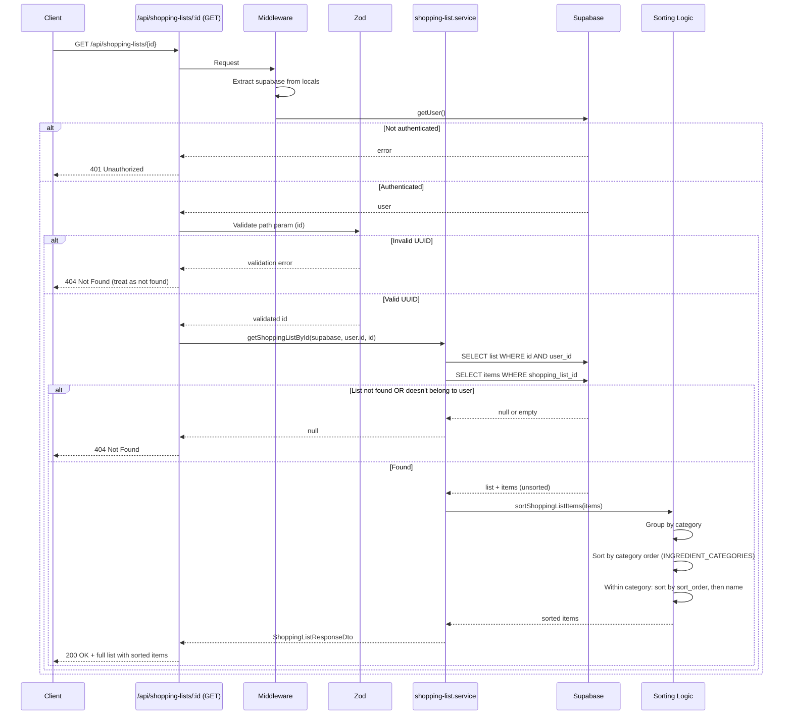

# API Endpoint Implementation Plan: GET /api/shopping-lists/:id

## 1. Przegląd punktu końcowego

**Endpoint:** GET `/api/shopping-lists/:id`

**Cel:** Pobranie pojedynczej listy zakupów ze wszystkimi itemami, posortowanymi według kategorii (fixed order), sort_order, i alfabetycznie.

**Use Case:**
- Wyświetlenie szczegółów zapisanej listy zakupów
- Eksport listy do PDF/TXT
- Edycja listy (checkowanie itemów)

**Kluczowe wymagania:**
- Items są sortowane w fixed order kategorii (Nabiał → Warzywa → Owoce → Mięso → Pieczywo → Przyprawy → Inne)
- Within category: sort by sort_order, then alphabetically
- User widzi tylko swoje listy (RLS)
- 404 dla nieistniejących lub nie należących list

---

## 2. Szczegóły żądania

### Metoda HTTP
`GET`

### Struktura URL
`/api/shopping-lists/:id`

**Path Parameters:**
- `id` (string, UUID, required) - Identyfikator listy zakupów

### Headers
- `Authorization: Bearer {access_token}` (automatycznie przez Supabase client)

### Query Parameters
Brak

### Request Body
Brak (GET request)

---

## 3. Wykorzystywane typy

### Response DTOs

**ShoppingListResponseDto** - już zdefiniowany w `src/types.ts:278-280`
```typescript
export interface ShoppingListResponseDto extends ShoppingList {
  items: ShoppingListItemDto[];
}
```

**ShoppingListItemDto** - już zdefiniowany w `src/types.ts:272`
```typescript
export type ShoppingListItemDto = ShoppingListItem;
```

### Entity Types

**ShoppingList** - z `src/types.ts:28`
```typescript
export type ShoppingList = Database["public"]["Tables"]["shopping_lists"]["Row"];
// Contains: id, user_id, name, week_start_date, created_at, updated_at
```

**ShoppingListItem** - z `src/types.ts:32`
```typescript
export type ShoppingListItem = Database["public"]["Tables"]["shopping_list_items"]["Row"];
// Contains: id, shopping_list_id, ingredient_name, quantity, unit, category, is_checked, sort_order
```

### Constants

**INGREDIENT_CATEGORIES** - z `src/types.ts:53-61`
```typescript
export const INGREDIENT_CATEGORIES: IngredientCategory[] = [
  "Nabiał",
  "Warzywa",
  "Owoce",
  "Mięso",
  "Pieczywo",
  "Przyprawy",
  "Inne",
];
```
**Note:** Ta tablica definiuje fixed order dla sortowania!

### Error Response DTOs

**ErrorResponseDto** - już zdefiniowany w `src/types.ts:373-376`
```typescript
export interface ErrorResponseDto {
  error: string;
  message?: string;
}
```

### Validation Schema (New)

**Path parameter validation schema:**
```typescript
// src/lib/validation/shopping-list.schema.ts
export const shoppingListIdParamSchema = z.object({
  id: z.string().uuid("Invalid shopping list ID format")
});

export type ShoppingListIdParam = z.infer<typeof shoppingListIdParamSchema>;
```

---

## 4. Szczegóły odpowiedzi

### Success Response (200 OK)

```json
{
  "id": "850e8400-e29b-41d4-a716-446655440000",
  "user_id": "123e4567-e89b-12d3-a456-426614174000",
  "name": "Lista zakupów - Tydzień 20-26 stycznia",
  "week_start_date": "2025-01-20",
  "created_at": "2025-01-26T14:00:00Z",
  "updated_at": "2025-01-26T14:00:00Z",
  "items": [
    {
      "id": "item-1-uuid",
      "shopping_list_id": "850e8400-e29b-41d4-a716-446655440000",
      "ingredient_name": "mleko",
      "quantity": 1,
      "unit": "l",
      "category": "Nabiał",
      "is_checked": false,
      "sort_order": 0
    },
    {
      "id": "item-2-uuid",
      "shopping_list_id": "850e8400-e29b-41d4-a716-446655440000",
      "ingredient_name": "ser",
      "quantity": 200,
      "unit": "g",
      "category": "Nabiał",
      "is_checked": true,
      "sort_order": 1
    },
    {
      "id": "item-3-uuid",
      "shopping_list_id": "850e8400-e29b-41d4-a716-446655440000",
      "ingredient_name": "pomidor",
      "quantity": 500,
      "unit": "g",
      "category": "Warzywa",
      "is_checked": false,
      "sort_order": 0
    }
    // ... more items, sorted by category order
  ]
}
```

**Sortowanie itemów:**
1. **Category** - fixed order: Nabiał, Warzywa, Owoce, Mięso, Pieczywo, Przyprawy, Inne
2. **sort_order** - within each category (ascending)
3. **ingredient_name** - alphabetically, case-insensitive (within same sort_order)

### Error Responses

**401 Unauthorized:**
```json
{
  "error": "Unauthorized",
  "message": "You must be logged in to view shopping lists"
}
```

**404 Not Found:**
```json
{
  "error": "Not Found",
  "message": "Shopping list not found"
}
```
**Note:** Zwracamy 404 zarówno gdy lista nie istnieje, jak i gdy nie należy do usera (security best practice - nie ujawniamy czy lista istnieje)

**500 Internal Server Error:**
```json
{
  "error": "Internal server error",
  "message": "Failed to fetch shopping list"
}
```

---

## 5. Przepływ danych



### Detailed Flow:

1. **Authentication (Middleware)**
   - Extract Supabase client from `locals`
   - Call `supabase.auth.getUser()`
   - If error or no user → return 401

2. **Path Parameter Validation**
   - Extract `id` from URL params
   - Validate with Zod: must be valid UUID
   - If invalid UUID → return 404 (not 400, security best practice)

3. **Fetch Shopping List (Service)**
   - Query shopping_lists table: `WHERE id = {id} AND user_id = {userId}`
   - RLS policy will also enforce user_id match
   - If not found → return 404

4. **Fetch Items (Service)**
   - Query shopping_list_items table: `WHERE shopping_list_id = {id}`
   - RLS policy ensures items belong to user's list
   - Returns unsorted items

5. **Sort Items (Service Helper)**
   - Group items by category
   - Sort categories by INGREDIENT_CATEGORIES order
   - Within each category:
     - Sort by `sort_order` (ascending)
     - Then by `ingredient_name` (case-insensitive alphabetical)

6. **Return Response**
   - Combine list + sorted items into ShoppingListResponseDto
   - Return 200 OK

---

## 6. Względy bezpieczeństwa

### 1. Uwierzytelnianie (Authentication)

**Requirement:** User MUSI być zalogowany

**Implementation:**
```typescript
const { data: { user }, error } = await supabase.auth.getUser();
if (error || !user) {
  return new Response(JSON.stringify({
    error: "Unauthorized",
    message: "You must be logged in to view shopping lists"
  }), {
    status: 401,
    headers: { "Content-Type": "application/json" }
  });
}
```

**Location:** Na początku GET handler

### 2. Autoryzacja (Authorization)

**Requirement:** User może zobaczyć TYLKO swoje listy

**Implementation:**
- **RLS Policy:** Already exists (`auth.uid() = user_id`)
- **Manual Check:** Query filtruje po `user_id` AND `id`
- **404 Response:** Jeśli lista nie należy do usera → 404 (not 403)

**Why 404 instead of 403?**
- Security best practice: nie ujawniamy czy lista istnieje
- Zapobiega enumeration attacks (testing which IDs exist)

### 3. Walidacja danych (Input Validation)

**UUID Validation:**
```typescript
const validation = shoppingListIdParamSchema.safeParse({ id: listId });
if (!validation.success) {
  // Return 404 (not 400) - security best practice
  return new Response(JSON.stringify({
    error: "Not Found",
    message: "Shopping list not found"
  }), { status: 404 });
}
```

**Why validate UUID?**
- Prevents SQL injection (though Supabase client protects against this)
- Prevents database errors from invalid UUIDs
- Early return for obviously invalid IDs

### 4. RLS (Row Level Security)

**Existing Policy:**
```sql
CREATE POLICY "Users can access their own shopping lists"
ON shopping_lists
FOR ALL
USING (auth.uid() = user_id);

CREATE POLICY "Users can access shopping list items via list ownership"
ON shopping_list_items
FOR ALL
USING (
  EXISTS (
    SELECT 1 FROM shopping_lists
    WHERE shopping_lists.id = shopping_list_items.shopping_list_id
    AND shopping_lists.user_id = auth.uid()
  )
);
```

**How it helps:**
- Automatic filtering at database level
- Cannot be bypassed even with direct SQL injection
- Items are automatically filtered through list ownership

### 5. Information Disclosure

**What NOT to expose:**
- ❌ Don't reveal if list exists but belongs to another user (use 404, not 403)
- ❌ Don't expose user_id of other users
- ❌ Don't show stack traces in production

**What to expose:**
- ✅ Generic error messages ("Shopping list not found")
- ✅ User's own data (list + items)

### 6. Rate Limiting

**Handled by Supabase:**
- Free tier: 50 req/sec
- Pro tier: 200 req/sec
- No custom rate limiting needed for MVP

### 7. HTTPS & Transport Security

**Handled by Vercel:**
- Automatic HTTPS
- SSL certificates
- Secure headers

---

## 7. Obsługa błędów

### Error Scenarios & Handling

| Kod | Scenariusz | Response | Handling |
|-----|-----------|----------|----------|
| **200** | Sukces | Pełna lista z sorted items | Return ShoppingListResponseDto |
| **401** | Brak auth token | `{ error: "Unauthorized", message: "You must be logged in..." }` | getUser() check |
| **401** | Nieprawidłowy token | `{ error: "Unauthorized", message: "Invalid authentication token" }` | getUser() error |
| **404** | Invalid UUID format | `{ error: "Not Found", message: "Shopping list not found" }` | Zod validation fail → treat as 404 |
| **404** | Lista nie istnieje | `{ error: "Not Found", message: "Shopping list not found" }` | Query returns null |
| **404** | Lista należy do innego usera | `{ error: "Not Found", message: "Shopping list not found" }` | RLS filters it out → null result |
| **500** | Database error (SELECT failed) | `{ error: "Internal server error", message: "Failed to fetch..." }` | Try-catch, log to console/Sentry |
| **500** | Unexpected error | `{ error: "Internal server error" }` | Try-catch, log to console/Sentry |

### Error Handling Strategy

**Development:**
```typescript
catch (error) {
  console.error("Error fetching shopping list:", error);
  // Stack trace in console
}
```

**Production:**
```typescript
catch (error) {
  Sentry.captureException(error, {
    tags: { endpoint: "GET /api/shopping-lists/:id" },
    extra: { userId: user.id, listId: id }
  });
  // Generic error message to client
}
```

### Important Notes:

1. **404 vs 403:** Always return 404 (not 403) when list doesn't exist or doesn't belong to user
   - Reason: Security - don't reveal which IDs exist
   - Standard practice for REST APIs

2. **Invalid UUID → 404:** Treat invalid UUID as "not found" (not 400 validation error)
   - Reason: UUID validation is implementation detail
   - User shouldn't know the difference

3. **No 400 errors:** This endpoint doesn't have request body, so no validation errors possible
   - Only path param, which we treat as 404 if invalid

---

## 8. Rozważania dotyczące wydajności

### 1. Database Queries

**Query 1: Fetch shopping list**
```typescript
const { data: list } = await supabase
  .from('shopping_lists')
  .select('*')
  .eq('id', listId)
  .eq('user_id', userId)  // Explicit filter (RLS also applies)
  .single();
```

**Query 2: Fetch items**
```typescript
const { data: items } = await supabase
  .from('shopping_list_items')
  .select('*')
  .eq('shopping_list_id', listId);
```

**Optimization: Single Query with JOIN**

**Option A: Separate queries** (current approach)
- Pros: Simple, clear error handling (list not found vs no items)
- Cons: 2 database roundtrips

**Option B: Single query with nested select**
```typescript
const { data } = await supabase
  .from('shopping_lists')
  .select('*, shopping_list_items(*)')
  .eq('id', listId)
  .eq('user_id', userId)
  .single();
```
- Pros: 1 database roundtrip, better performance
- Cons: Slightly more complex error handling

**Recommendation:** Use Option B (single query) for better performance

### 2. Indexes

**Required indexes** (already exist from POST/GET endpoints):
- `shopping_lists.id` (PRIMARY KEY - automatic)
- `shopping_lists.user_id` (from idx_shopping_lists_user_id)
- `shopping_list_items.shopping_list_id` (from idx_shopping_list_items_list_id)

**Query performance:**
- List lookup by ID + user_id: **O(1)** with index
- Items lookup by shopping_list_id: **O(1)** with index
- Expected query time: **< 50ms** (fast, indexed lookups)

### 3. Sorting Performance

**Challenge:** Items must be sorted by:
1. Category (fixed order: Nabiał, Warzywa, ...)
2. sort_order within category
3. ingredient_name alphabetically (case-insensitive)

**Option A: Sort in SQL**
```sql
ORDER BY
  CASE category
    WHEN 'Nabiał' THEN 1
    WHEN 'Warzywa' THEN 2
    WHEN 'Owoce' THEN 3
    WHEN 'Mięso' THEN 4
    WHEN 'Pieczywo' THEN 5
    WHEN 'Przyprawy' THEN 6
    ELSE 7
  END,
  sort_order,
  LOWER(ingredient_name)
```
- Pros: Database does the sorting (faster for large lists)
- Cons: Hardcoded category order in SQL (less maintainable)

**Option B: Sort in Application**
```typescript
function sortShoppingListItems(items: ShoppingListItemDto[]): ShoppingListItemDto[] {
  const categoryOrder = INGREDIENT_CATEGORIES.reduce((acc, cat, idx) => {
    acc[cat] = idx;
    return acc;
  }, {} as Record<string, number>);

  return items.sort((a, b) => {
    // 1. Sort by category order
    const catDiff = categoryOrder[a.category] - categoryOrder[b.category];
    if (catDiff !== 0) return catDiff;

    // 2. Sort by sort_order
    const sortDiff = a.sort_order - b.sort_order;
    if (sortDiff !== 0) return sortDiff;

    // 3. Sort by name (case-insensitive)
    return a.ingredient_name.toLowerCase().localeCompare(b.ingredient_name.toLowerCase());
  });
}
```
- Pros: Uses INGREDIENT_CATEGORIES constant (single source of truth)
- Cons: Client-side sorting (but negligible for max 100 items)

**Recommendation:** Use Option B (application sorting)
- Reason: Max 100 items per list → sorting is **O(n log n)** = ~700 comparisons max
- Benefit: DRY principle (INGREDIENT_CATEGORIES is already defined in types.ts)
- Performance: < 1ms for 100 items (negligible)

### 4. Caching Strategy

**Server-side caching:**
- ❌ Not recommended for MVP
- Reason: Shopping lists are mutable (is_checked can change)
- Lists are personal (can't use shared cache)

**Client-side caching:**
- ✅ Recommended
- React Query with stale time:
```typescript
useQuery(['shopping-list', id], () => fetchShoppingList(id), {
  staleTime: 5 * 60 * 1000, // 5 minutes
  cacheTime: 30 * 60 * 1000, // 30 minutes
});
```

**HTTP Cache headers:**
```typescript
headers: {
  'Content-Type': 'application/json',
  'Cache-Control': 'private, max-age=300', // 5 min cache
}
```

### 5. Payload Size

**Typical list:**
- List metadata: ~200 bytes
- Item: ~150 bytes (ingredient_name, quantity, unit, category, etc.)
- Max items: 100

**Max payload size:**
- 200 + (100 × 150) = **~15KB**
- Very light, no compression needed

**Average payload:**
- ~20-30 items typical
- 200 + (25 × 150) = **~4KB**

### 6. Performance Targets

| Metric | Target | Notes |
|--------|--------|-------|
| **Database query time** | < 50ms | Indexed lookups (id, user_id, shopping_list_id) |
| **Sorting time** | < 1ms | Max 100 items, O(n log n) in memory |
| **Total response time (p95)** | < 150ms | Query + sort + serialization |
| **Payload size** | < 20KB | Max 100 items × ~150 bytes |

### 7. Potential Bottlenecks

| Bottleneck | Impact | Mitigation |
|-----------|--------|-----------|
| **RLS policy evaluation** | Low | Already have indexes on user_id |
| **Multiple roundtrips** | Low | Use single query with JOIN |
| **Sorting 100 items** | Very Low | < 1ms in memory |
| **Large lists (100 items)** | Low | 15KB payload is light |

---

## 9. Etapy wdrożenia

### Faza 1: Validation Schema (15 min)

#### Krok 1.1: Rozszerz istniejący schema file

**File:** `src/lib/validation/shopping-list.schema.ts`

**Dodaj:**
```typescript
/**
 * Schema for path parameter validation (GET /api/shopping-lists/:id)
 */
export const shoppingListIdParamSchema = z.object({
  id: z.string().uuid("Invalid shopping list ID format"),
});

/**
 * Type inference for path param
 */
export type ShoppingListIdParam = z.infer<typeof shoppingListIdParamSchema>;
```

**Verification:**
```bash
npm run build
# Should compile without errors
```

---

### Faza 2: Service Layer - Sorting Helper (20 min)

#### Krok 2.1: Dodaj sorting function do service

**File:** `src/lib/services/shopping-list.service.ts`

**Add to imports:**
```typescript
import { INGREDIENT_CATEGORIES } from "@/types";
```

**Add helper function:**
```typescript
/**
 * Sort shopping list items by category (fixed order), sort_order, and name
 *
 * Sorting order:
 * 1. Category - fixed order from INGREDIENT_CATEGORIES constant
 * 2. sort_order - within each category (ascending)
 * 3. ingredient_name - alphabetically, case-insensitive (within same sort_order)
 *
 * @param items - Unsorted shopping list items
 * @returns Sorted shopping list items
 */
function sortShoppingListItems(
  items: ShoppingListItemDto[]
): ShoppingListItemDto[] {
  // Create category order map for O(1) lookup
  const categoryOrder = INGREDIENT_CATEGORIES.reduce((acc, category, index) => {
    acc[category] = index;
    return acc;
  }, {} as Record<string, number>);

  return [...items].sort((a, b) => {
    // 1. Sort by category order (fixed order from INGREDIENT_CATEGORIES)
    const categoryDiff = categoryOrder[a.category] - categoryOrder[b.category];
    if (categoryDiff !== 0) return categoryDiff;

    // 2. Sort by sort_order within category
    const sortOrderDiff = a.sort_order - b.sort_order;
    if (sortOrderDiff !== 0) return sortOrderDiff;

    // 3. Sort alphabetically by ingredient name (case-insensitive)
    return a.ingredient_name
      .toLowerCase()
      .localeCompare(b.ingredient_name.toLowerCase());
  });
}
```

---

### Faza 3: Service Layer - Get by ID Function (30 min)

#### Krok 3.1: Dodaj getShoppingListById function

**File:** `src/lib/services/shopping-list.service.ts`

**Add new export:**
```typescript
/**
 * Get a single shopping list by ID with all items (sorted)
 * Returns null if list not found or doesn't belong to user
 *
 * @param supabase - Authenticated Supabase client
 * @param userId - ID of the user
 * @param listId - ID of the shopping list
 * @returns Shopping list with sorted items, or null if not found
 * @throws Error if database query fails
 */
export async function getShoppingListById(
  supabase: SupabaseClient,
  userId: string,
  listId: string
): Promise<ShoppingListResponseDto | null> {
  // Fetch shopping list with items in a single query (optimized)
  const { data, error } = await supabase
    .from("shopping_lists")
    .select("*, shopping_list_items(*)")
    .eq("id", listId)
    .eq("user_id", userId) // Explicit filter (RLS also enforces this)
    .single();

  if (error) {
    // Not found errors are expected (return null)
    if (error.code === "PGRST116") {
      return null;
    }
    // Other errors are unexpected (throw)
    throw new Error(`Failed to fetch shopping list: ${error.message}`);
  }

  // Data not found (shouldn't happen with .single(), but defensive coding)
  if (!data) {
    return null;
  }

  // Extract items and sort them
  const items = data.shopping_list_items || [];
  const sortedItems = sortShoppingListItems(items);

  // Return response DTO
  return {
    id: data.id,
    user_id: data.user_id,
    name: data.name,
    week_start_date: data.week_start_date,
    created_at: data.created_at,
    updated_at: data.updated_at,
    items: sortedItems,
  };
}
```

**Verification:**
```bash
npm run build
# Should compile without errors
```

---

### Faza 4: API Endpoint (30 min)

#### Krok 4.1: Utwórz dynamic route file

**File:** `src/pages/api/shopping-lists/[id].ts` (NEW)

**Content:**
```typescript
/**
 * Shopping List by ID API Endpoint
 * GET /api/shopping-lists/:id - Get single shopping list with all items
 */

import type { APIRoute } from "astro";
import { shoppingListIdParamSchema } from "@/lib/validation/shopping-list.schema";
import { getShoppingListById } from "@/lib/services/shopping-list.service";
import type { ErrorResponseDto } from "@/types";

export const prerender = false;

/**
 * GET /api/shopping-lists/:id
 * Get a single shopping list with all items (sorted by category, sort_order, name)
 *
 * Response: 200 OK with ShoppingListResponseDto
 * Errors: 401 (unauthorized), 404 (not found), 500 (server error)
 */
export const GET: APIRoute = async ({ params, locals }) => {
  try {
    // Step 1: Authentication
    const supabase = locals.supabase;
    const {
      data: { user },
      error: authError,
    } = await supabase.auth.getUser();

    if (authError || !user) {
      const errorResponse: ErrorResponseDto = {
        error: "Unauthorized",
        message: "You must be logged in to view shopping lists",
      };
      return new Response(JSON.stringify(errorResponse), {
        status: 401,
        headers: { "Content-Type": "application/json" },
      });
    }

    // Step 2: Validate path parameter (id)
    const listId = params.id;
    const validation = shoppingListIdParamSchema.safeParse({ id: listId });

    if (!validation.success) {
      // Invalid UUID format - treat as 404 (security best practice)
      const errorResponse: ErrorResponseDto = {
        error: "Not Found",
        message: "Shopping list not found",
      };
      return new Response(JSON.stringify(errorResponse), {
        status: 404,
        headers: { "Content-Type": "application/json" },
      });
    }

    // Step 3: Fetch shopping list by ID via service
    const shoppingList = await getShoppingListById(
      supabase,
      user.id,
      validation.data.id
    );

    // Step 4: Check if found
    if (!shoppingList) {
      // Not found or doesn't belong to user - return 404
      const errorResponse: ErrorResponseDto = {
        error: "Not Found",
        message: "Shopping list not found",
      };
      return new Response(JSON.stringify(errorResponse), {
        status: 404,
        headers: { "Content-Type": "application/json" },
      });
    }

    // Step 5: Return shopping list with sorted items
    return new Response(JSON.stringify(shoppingList), {
      status: 200,
      headers: {
        "Content-Type": "application/json",
        "Cache-Control": "private, max-age=300", // 5 min cache
      },
    });
  } catch (error) {
    console.error("Error fetching shopping list:", error);

    const errorResponse: ErrorResponseDto = {
      error: "Internal server error",
      message: "Failed to fetch shopping list",
    };
    return new Response(JSON.stringify(errorResponse), {
      status: 500,
      headers: { "Content-Type": "application/json" },
    });
  }
};
```

---

### Faza 5: Testing (45 min)

#### Krok 5.1: Compile check

```bash
npm run build
# Should pass without errors
```

#### Krok 5.2: Manual Testing

**Prerequisites:**
- Server running: `npm run dev`
- Valid access token from authenticated user
- At least one shopping list created

**Test Cases:**

**TC1: Successful fetch (200 OK)**
```bash
# Get list ID from GET /api/shopping-lists first
LIST_ID="your-list-id-here"

curl -X GET "http://localhost:3001/api/shopping-lists/$LIST_ID" \
  -H "Authorization: Bearer $ACCESS_TOKEN"

# Expected: 200 OK with full list + sorted items
# Verify items are sorted by: category → sort_order → name
```

**TC2: Invalid UUID format (404)**
```bash
curl -X GET "http://localhost:3001/api/shopping-lists/invalid-uuid" \
  -H "Authorization: Bearer $ACCESS_TOKEN"

# Expected: 404 Not Found
# { "error": "Not Found", "message": "Shopping list not found" }
```

**TC3: Non-existent ID (404)**
```bash
curl -X GET "http://localhost:3001/api/shopping-lists/00000000-0000-0000-0000-000000000000" \
  -H "Authorization: Bearer $ACCESS_TOKEN"

# Expected: 404 Not Found
# { "error": "Not Found", "message": "Shopping list not found" }
```

**TC4: Unauthorized - no token (401)**
```bash
curl -X GET "http://localhost:3001/api/shopping-lists/$LIST_ID"

# Expected: 401 Unauthorized
# { "error": "Unauthorized", "message": "You must be logged in..." }
```

**TC5: List belongs to another user (404)**
```bash
# Use LIST_ID from User A, but token from User B
curl -X GET "http://localhost:3001/api/shopping-lists/$USER_A_LIST_ID" \
  -H "Authorization: Bearer $USER_B_TOKEN"

# Expected: 404 Not Found (security - don't reveal it exists)
```

**TC6: Verify sorting**
```bash
# Create a test list with items in different categories
# Verify response has items sorted correctly:
# 1. Nabiał items first
# 2. Then Warzywa
# 3. Then Owoce, Mięso, Pieczywo, Przyprawy, Inne
# Within each category: sorted by sort_order, then alphabetically
```

#### Krok 5.3: Create test documentation

**File:** `.ai/doc/18_11_GET-shopping-lists-id-manual-tests.md`

Document all test cases with:
- Request examples
- Expected responses
- Actual results
- Pass/Fail status

---

### Faza 6: Update Implementation Summary (15 min)

**File:** `.ai/doc/18_10_POST-GET-shopping-lists-IMPLEMENTATION_SUMMARY.md`

**Add section:**
```markdown
### 3. GET /api/shopping-lists/:id
- **Status:** ✅ Completed
- **File:** `src/pages/api/shopping-lists/[id].ts`
- **Service:** `src/lib/services/shopping-list.service.ts` (`getShoppingListById`)
- **Validation:** `src/lib/validation/shopping-list.schema.ts` (`shoppingListIdParamSchema`)
- **Description:** Pobiera pojedynczą listę ze wszystkimi itemami, posortowanymi według kategorii

**Features:**
- Single query with JOIN for performance
- Items sorted by category (fixed order), sort_order, and name
- 404 for non-existent or not-owned lists (security)
- Cache-Control header (5 min)

**Testing:**
- ✅ TC1: Successful fetch
- ✅ TC2: Invalid UUID
- ✅ TC3: Non-existent ID
- ✅ TC4: Unauthorized
- ✅ TC5: Different user's list
- ✅ TC6: Verify sorting order
```

---

### Faza 7: Code Quality Check (15 min)

#### Krok 7.1: ESLint

```bash
npm run lint
# Fix any errors
```

#### Krok 7.2: TypeScript compilation

```bash
npm run build
# Should pass
```

#### Krok 7.3: Self code review checklist

- [ ] Endpoint returns correct status codes (200, 401, 404, 500)
- [ ] Validation schema works correctly
- [ ] Service function handles null case
- [ ] Sorting function uses INGREDIENT_CATEGORIES constant
- [ ] Items are sorted correctly (category → sort_order → name)
- [ ] 404 returned for both non-existent and not-owned lists
- [ ] Error handling is complete (try-catch)
- [ ] Response DTO matches types.ts
- [ ] Cache-Control header is set
- [ ] No SQL injection vulnerabilities (using Supabase client)
- [ ] RLS policies work correctly
- [ ] Single query with JOIN (performance optimization)
- [ ] Code comments are clear
- [ ] No console.logs in production code (only in error handlers)

---

## 10. Podsumowanie

### Pliki do utworzenia/edycji:

1. **Validation:**
   - `src/lib/validation/shopping-list.schema.ts` (edit - add schema)

2. **Services:**
   - `src/lib/services/shopping-list.service.ts` (edit - add functions)

3. **API Endpoints:**
   - `src/pages/api/shopping-lists/[id].ts` (NEW)

4. **Documentation:**
   - `.ai/doc/18_11_GET-shopping-lists-id-manual-tests.md` (NEW)
   - `.ai/doc/18_10_POST-GET-shopping-lists-IMPLEMENTATION_SUMMARY.md` (edit)

### Szacowany czas implementacji: 2-2.5 godzin

**Breakdown:**
- Validation schema: 15 min
- Service layer (sorting + get by id): 50 min
- API endpoint: 30 min
- Testing: 45 min
- Documentation & code review: 30 min

### Priorytety:

1. **HIGH:** Service layer (sorting logic critical)
2. **HIGH:** API endpoint (core functionality)
3. **MEDIUM:** Validation schema (UUID check)
4. **LOW:** Documentation (post-implementation)

### Sukces metrics:

- ✅ All test cases pass (6 test cases)
- ✅ Response time < 150ms
- ✅ Items are correctly sorted by category order
- ✅ 404 returned for invalid/non-existent/not-owned lists
- ✅ No TypeScript errors
- ✅ ESLint/Prettier pass
- ✅ Single query optimization works (no N+1 problem)

### Key Implementation Notes:

1. **Sorting:** Done in application layer using INGREDIENT_CATEGORIES constant
2. **Security:** Always return 404 (not 403) for not-owned lists
3. **Performance:** Use single query with JOIN for items
4. **Validation:** Invalid UUID treated as 404 (not 400)
5. **Caching:** 5 min private cache (Cache-Control header)

---

**Implementation ready!** Proceed with Faza 1.
