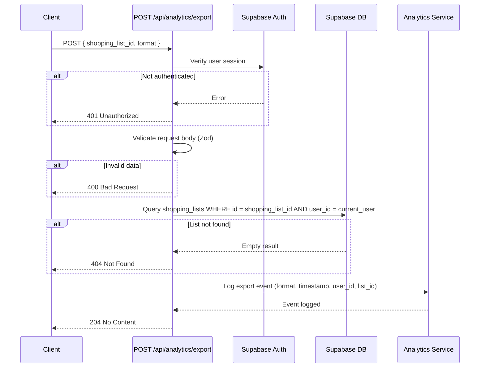

# API Endpoint Implementation Plan: POST /api/analytics/export

## 1. Przegląd punktu końcowego

Endpoint `POST /api/analytics/export` służy do śledzenia zdarzeń eksportu list zakupów w formatach PDF lub TXT dla celów analitycznych. Jest to opcjonalny endpoint, który **nie** generuje faktycznych plików (generowanie odbywa się po stronie klienta przy użyciu `@react-pdf/renderer`). Jego głównym zadaniem jest:

- Rejestrowanie statystyk wykorzystania funkcji eksportu
- Walidacja, że użytkownik ma dostęp do eksportowanej listy zakupów
- Potencjalne przyszłe wykorzystanie do analytics dashboardów

**Kluczowe charakterystyki:**
- Operacja asynchroniczna (fire-and-forget dla klienta)
- Minimalna odpowiedź (204 No Content)
- Fokus na bezpieczeństwie (weryfikacja własności listy)
- Brak wpływu na dane biznesowe (tylko tracking)

---

## 2. Szczegóły żądania

### Metoda HTTP
`POST`

### Struktura URL
```
/api/analytics/export
```

### Headers
```http
Content-Type: application/json
Cookie: sb-access-token, sb-refresh-token (Supabase auth)
```

### Parametry
**Wymagane:**
- Brak parametrów URL

**Opcjonalne:**
- Brak

### Request Body
```typescript
{
  "shopping_list_id": "850e8400-e29b-41d4-a716-446655440000", // UUID listy zakupów
  "format": "pdf" // "pdf" | "txt"
}
```

**Struktura zgodna z typem:** `TrackExportDto` (src/types.ts:399-402)

---

## 3. Wykorzystywane typy

### Command Model (Input)
```typescript
// src/types.ts:399-402
export interface TrackExportDto {
  shopping_list_id: string;
  format: "pdf" | "txt";
}
```

### Response Types
```typescript
// Brak response body - 204 No Content
export type NoContentResponse = Record<string, never>;

// Error responses
export interface ErrorResponseDto {
  error: string;
  message?: string;
}

export interface ValidationErrorResponseDto {
  error: string;
  details: ValidationErrorDetails;
}
```

### Database Types (dla walidacji)
```typescript
// src/db/database.types.ts
export type ShoppingList = Database["public"]["Tables"]["shopping_lists"]["Row"];
```

---

## 4. Szczegóły odpowiedzi

### Success Response (204 No Content)
```http
HTTP/1.1 204 No Content
```
- **Brak response body**
- Zwracane gdy tracking został zalogowany pomyślnie
- Klient nie czeka na żadne dane zwrotne

### Error Responses

#### 400 Bad Request
```json
{
  "error": "Validation failed",
  "details": {
    "shopping_list_id": ["Invalid UUID format"],
    "format": ["Must be 'pdf' or 'txt'"]
  }
}
```

#### 401 Unauthorized
```json
{
  "error": "Unauthorized",
  "message": "Authentication required"
}
```

#### 404 Not Found
```json
{
  "error": "Not found",
  "message": "Shopping list not found or access denied"
}
```

#### 500 Internal Server Error
```json
{
  "error": "Internal server error",
  "message": "Failed to track export event"
}
```

---

## 5. Przepływ danych



### Szczegółowy przepływ:

1. **Autentykacja** (src/middleware/index.ts)
   - Middleware Astro weryfikuje sesję Supabase
   - Dostęp do `context.locals.supabase` i `context.locals.user`

2. **Walidacja danych wejściowych**
   - Zod schema waliduje `shopping_list_id` (UUID format) i `format` (enum)
   - Early return z 400 Bad Request jeśli walidacja fails

3. **Autoryzacja**
   - Query do `shopping_lists` z filtrem: `id = shopping_list_id AND user_id = current_user_id`
   - Jeśli brak wyników → 404 Not Found (security best practice: nie ujawniaj czy lista istnieje)

4. **Tracking zdarzenia**
   - Opcja A: Console.log dla MVP (najprostsze)
   - Opcja B: Zapis do Sentry jako custom event
   - Opcja C: Przyszła tabela `analytics_events` (out of scope dla MVP)

5. **Odpowiedź**
   - Zwrócenie 204 No Content bez body

---

## 6. Względy bezpieczeństwa

### Autentykacja
- **Wymagana:** Użytkownik musi być zalogowany
- **Mechanizm:** Supabase Auth session cookies
- **Walidacja:** `context.locals.user` musi być present
- **Kod błędu:** 401 jeśli nie zalogowany

### Autoryzacja (RLS-equivalent)
- **Zasada:** Użytkownik może trackować tylko własne listy
- **Implementacja:** Explicit query z filtrem `user_id`
  ```typescript
  const { data: list } = await supabase
    .from('shopping_lists')
    .select('id')
    .eq('id', shopping_list_id)
    .eq('user_id', user.id)
    .single();

  if (!list) {
    return new Response(JSON.stringify({
      error: "Not found",
      message: "Shopping list not found or access denied"
    }), { status: 404 });
  }
  ```

### Walidacja danych wejściowych
- **UUID validation:** Zapobieganie SQL injection (choć Supabase client sanitizes)
- **Enum validation:** `format` tylko "pdf" | "txt"
- **Brak dodatkowych pól:** Zod `.strict()` zapobiega unexpected fields

### Rate Limiting
- **Supabase default:** 100 req/min per IP (Free tier)
- **Opcjonalnie:** Custom rate limiting w middleware (post-MVP)
- **Uwaga:** To lightweight endpoint, rate limiting mniej krytyczne

### CORS
- **Vercel default:** Same-origin policy
- **Astro middleware:** Brak custom CORS headers potrzebnych dla SPA

### Logging wrażliwych danych
- **NIE logować:** User IDs, email, session tokens
- **Logować:** `shopping_list_id`, `format`, timestamp, IP (jeśli analytics)
- **Sentry:** Filtrowanie PII w Sentry config

---

## 7. Obsługa błędów

### Tabela scenariuszy błędów

| Scenariusz | Kod | Response Body | Handling |
|------------|-----|---------------|----------|
| Brak autentykacji | 401 | `{ error: "Unauthorized", message: "Authentication required" }` | Early return jeśli `!context.locals.user` |
| Nieprawidłowy UUID | 400 | `{ error: "Validation failed", details: { shopping_list_id: [...] } }` | Zod validation error |
| Nieprawidłowy format | 400 | `{ error: "Validation failed", details: { format: [...] } }` | Zod validation error |
| Lista nie istnieje | 404 | `{ error: "Not found", message: "Shopping list not found or access denied" }` | Empty query result |
| Brak dostępu do listy | 404 | `{ error: "Not found", message: "Shopping list not found or access denied" }` | `user_id` mismatch (nie ujawniamy powodu) |
| Błąd Supabase | 500 | `{ error: "Internal server error", message: "Failed to track export event" }` | Catch block, log do Sentry |
| Błąd analytics service | 500 | `{ error: "Internal server error", message: "Failed to track export event" }` | Catch block, log do Sentry |

### Error Handling Pattern

```typescript
try {
  // 1. Auth check (middleware powinno to załatwić, ale double-check)
  const user = context.locals.user;
  if (!user) {
    return new Response(JSON.stringify({
      error: "Unauthorized",
      message: "Authentication required"
    }), {
      status: 401,
      headers: { 'Content-Type': 'application/json' }
    });
  }

  // 2. Validation
  const validation = trackExportSchema.safeParse(body);
  if (!validation.success) {
    return new Response(JSON.stringify({
      error: "Validation failed",
      details: validation.error.flatten().fieldErrors
    }), {
      status: 400,
      headers: { 'Content-Type': 'application/json' }
    });
  }

  // 3. Authorization check
  const { data: list, error: listError } = await supabase
    .from('shopping_lists')
    .select('id')
    .eq('id', validated.shopping_list_id)
    .eq('user_id', user.id)
    .single();

  if (listError || !list) {
    return new Response(JSON.stringify({
      error: "Not found",
      message: "Shopping list not found or access denied"
    }), {
      status: 404,
      headers: { 'Content-Type': 'application/json' }
    });
  }

  // 4. Track event (non-blocking ideally)
  await trackExportEvent({
    userId: user.id,
    shoppingListId: validated.shopping_list_id,
    format: validated.format,
    timestamp: new Date().toISOString()
  });

  // 5. Success response
  return new Response(null, { status: 204 });

} catch (error) {
  console.error('[POST /api/analytics/export] Error:', error);
  // Log to Sentry in production

  return new Response(JSON.stringify({
    error: "Internal server error",
    message: "Failed to track export event"
  }), {
    status: 500,
    headers: { 'Content-Type': 'application/json' }
  });
}
```

---

## 8. Rozważania dotyczące wydajności

### Potencjalne wąskie gardła

1. **Database query (shopping_lists ownership check)**
   - **Impact:** Low (indexed query, single row)
   - **Optymalizacja:**
     - Index na `(id, user_id)` compound (prawdopodobnie już istnieje)
     - Query tylko `id` (bez `SELECT *`)
   - **Expected latency:** <50ms

2. **Analytics tracking (zapis eventu)**
   - **Impact:** Medium (jeśli synchroniczne)
   - **Optymalizacja:**
     - **MVP:** Console.log (0ms overhead)
     - **Post-MVP:** Asynchroniczne wysłanie do analytics service
     - **Opcjonalnie:** Fire-and-forget pattern (nie czekaj na potwierdzenie)

3. **Network latency (Supabase hosted)**
   - **Impact:** Low (Vercel Edge Functions blisko Supabase regionów)
   - **Expected total latency:** <200ms dla całego endpointa

### Strategie optymalizacji

#### Immediate (MVP)
- ✅ Lightweight query (tylko `id` field)
- ✅ Early returns (guard clauses)
- ✅ Brak heavy computations
- ✅ 204 No Content (brak serializacji response body)

#### Future (Post-MVP)
- 🔮 Async analytics tracking (non-blocking):
  ```typescript
  // Fire-and-forget
  trackExportEvent(...).catch(err => console.error('Analytics error:', err));
  return new Response(null, { status: 204 });
  ```
- 🔮 Rate limiting per user (zapobieganie abuse)
- 🔮 Caching ownership checks (jeśli repeated calls)

### Monitoring
- **Sentry:** Track average response time
- **Metric:** `analytics.export.duration`
- **Alert:** Jeśli p95 > 500ms

---

## 9. Etapy wdrożenia

### Krok 1: Utworzenie Zod schema walidacji
**Plik:** `src/lib/validation/analytics.schema.ts`

```typescript
import { z } from 'zod';

export const trackExportSchema = z.object({
  shopping_list_id: z.string().uuid({
    message: "Invalid shopping list ID format"
  }),
  format: z.enum(['pdf', 'txt'], {
    errorMap: () => ({ message: "Format must be 'pdf' or 'txt'" })
  })
}).strict();

export type TrackExportInput = z.infer<typeof trackExportSchema>;
```

**Testy:**
- ✅ Valid UUID + "pdf" → passes
- ✅ Valid UUID + "txt" → passes
- ❌ Invalid UUID → fails with message
- ❌ format = "docx" → fails with message
- ❌ Extra fields → fails (strict mode)

---

### Krok 2: Utworzenie serwisu analytics (opcjonalne dla MVP)
**Plik:** `src/lib/services/analytics.service.ts`

```typescript
interface ExportEvent {
  userId: string;
  shoppingListId: string;
  format: 'pdf' | 'txt';
  timestamp: string;
}

export async function trackExportEvent(event: ExportEvent): Promise<void> {
  // MVP: Simple console logging
  console.log('[Analytics] Export event:', {
    user: event.userId,
    list: event.shoppingListId,
    format: event.format,
    time: event.timestamp
  });

  // Future: Send to analytics service
  // await fetch('https://analytics.example.com/events', {
  //   method: 'POST',
  //   body: JSON.stringify(event)
  // });
}
```

**Uwaga:** Dla MVP, ten serwis może być bardzo prosty (console.log). W przyszłości można rozbudować o integracje z Plausible, Google Analytics 4, lub custom analytics DB.

---

### Krok 3: Implementacja endpointa API
**Plik:** `src/pages/api/analytics/export.ts`

```typescript
import type { APIRoute } from 'astro';
import { trackExportSchema } from '@/lib/validation/analytics.schema';
import { trackExportEvent } from '@/lib/services/analytics.service';

export const prerender = false;

export const POST: APIRoute = async ({ request, locals }) => {
  try {
    // 1. Authentication check
    const user = locals.user;
    if (!user) {
      return new Response(JSON.stringify({
        error: 'Unauthorized',
        message: 'Authentication required'
      }), {
        status: 401,
        headers: { 'Content-Type': 'application/json' }
      });
    }

    // 2. Parse and validate request body
    const body = await request.json();
    const validation = trackExportSchema.safeParse(body);

    if (!validation.success) {
      return new Response(JSON.stringify({
        error: 'Validation failed',
        details: validation.error.flatten().fieldErrors
      }), {
        status: 400,
        headers: { 'Content-Type': 'application/json' }
      });
    }

    const { shopping_list_id, format } = validation.data;

    // 3. Authorization: Check if shopping list belongs to user
    const { data: list, error: listError } = await locals.supabase
      .from('shopping_lists')
      .select('id')
      .eq('id', shopping_list_id)
      .eq('user_id', user.id)
      .single();

    if (listError || !list) {
      return new Response(JSON.stringify({
        error: 'Not found',
        message: 'Shopping list not found or access denied'
      }), {
        status: 404,
        headers: { 'Content-Type': 'application/json' }
      });
    }

    // 4. Track export event
    await trackExportEvent({
      userId: user.id,
      shoppingListId: shopping_list_id,
      format,
      timestamp: new Date().toISOString()
    });

    // 5. Success response (204 No Content)
    return new Response(null, { status: 204 });

  } catch (error) {
    console.error('[POST /api/analytics/export] Unexpected error:', error);

    // TODO: Send to Sentry in production
    // Sentry.captureException(error);

    return new Response(JSON.stringify({
      error: 'Internal server error',
      message: 'Failed to track export event'
    }), {
      status: 500,
      headers: { 'Content-Type': 'application/json' }
    });
  }
};
```

---

### Krok 4: Testy jednostkowe i integracyjne

**Test cases:**

1. **Pozytywne:**
   - ✅ Valid request → 204 No Content
   - ✅ PDF format → logged correctly
   - ✅ TXT format → logged correctly

2. **Autentykacja:**
   - ❌ No auth session → 401 Unauthorized
   - ❌ Invalid session → 401 Unauthorized

3. **Walidacja:**
   - ❌ Invalid UUID → 400 Bad Request
   - ❌ Invalid format → 400 Bad Request
   - ❌ Missing shopping_list_id → 400 Bad Request
   - ❌ Missing format → 400 Bad Request
   - ❌ Extra fields → 400 Bad Request

4. **Autoryzacja:**
   - ❌ Shopping list należy do innego użytkownika → 404 Not Found
   - ❌ Shopping list nie istnieje → 404 Not Found

5. **Błędy serwera:**
   - ❌ Supabase error → 500 Internal Server Error
   - ❌ Analytics service error → 500 Internal Server Error

**Narzędzia testowe:**
- Vitest (unit tests dla schema i service)
- Playwright/Cypress (E2E tests dla API endpoint)
- Postman/Thunder Client (manual testing)

---

### Krok 5: Dokumentacja i deployment

1. **OpenAPI/Swagger docs (opcjonalnie):**
   ```yaml
   /api/analytics/export:
     post:
       summary: Track export event
       tags: [Analytics]
       security:
         - cookieAuth: []
       requestBody:
         required: true
         content:
           application/json:
             schema:
               $ref: '#/components/schemas/TrackExportDto'
       responses:
         '204':
           description: Export event tracked successfully
         '401':
           $ref: '#/components/responses/Unauthorized'
         '400':
           $ref: '#/components/responses/ValidationError'
         '404':
           $ref: '#/components/responses/NotFound'
         '500':
           $ref: '#/components/responses/InternalError'
   ```

2. **README update:**
   - Dodaj endpoint do sekcji "Analytics API"
   - Przykład użycia z fetch/axios

3. **Vercel deployment:**
   - Endpoint automatycznie wdro deployed jako Serverless Function
   - Verify w Vercel logs po deployu

4. **Monitoring setup:**
   - Sentry error tracking enabled
   - Vercel Analytics dla performance metrics

---

### Krok 6: Integracja z komponentem frontend

**Komponent:** `src/components/ShoppingListExport.tsx`

```typescript
const handleExport = async (format: 'pdf' | 'txt') => {
  setIsLoading(true);

  try {
    // 1. Generate file client-side (existing logic)
    const blob = format === 'pdf'
      ? await generateShoppingListPDF(list, items)
      : generateShoppingListTXT(list, items);

    downloadFile(blob, `${list.name}-${format}`);

    // 2. Track export event (non-blocking)
    fetch('/api/analytics/export', {
      method: 'POST',
      headers: { 'Content-Type': 'application/json' },
      body: JSON.stringify({
        shopping_list_id: list.id,
        format
      })
    }).catch(err => {
      // Silent fail - analytics tracking nie powinno blokować UX
      console.warn('Failed to track export:', err);
    });

  } catch (error) {
    console.error('Export failed:', error);
    alert('Nie udało się wyeksportować listy');
  } finally {
    setIsLoading(false);
  }
};
```

**Uwaga:** Tracking request jest fire-and-forget - nie czekamy na odpowiedź, nie blokujemy UX.

---

## 10. Checklist przed merging do main

- [ ] Zod schema utworzony i przetestowany
- [ ] Analytics service zaimplementowany (console.log dla MVP)
- [ ] Endpoint API zaimplementowany zgodnie z planem
- [ ] Guard clauses dla authentication i authorization
- [ ] Error handling dla wszystkich edge cases
- [ ] 204 No Content response dla success case
- [ ] Testy jednostkowe (Zod schema validation)
- [ ] Testy integracyjne (E2E endpoint testing)
- [ ] Frontend integration (fire-and-forget tracking)
- [ ] ESLint passes (no warnings)
- [ ] TypeScript compiles (no errors)
- [ ] Manual testing w dev environment
- [ ] Code review (focus na security: RLS-like authorization)
- [ ] Sentry error tracking verified
- [ ] Vercel deployment successful
- [ ] Production smoke test (1 export tracked correctly)

---

## 11. Future Enhancements (Post-MVP)

1. **Persistent analytics table:**
   ```sql
   CREATE TABLE analytics_events (
     id UUID PRIMARY KEY DEFAULT gen_random_uuid(),
     user_id UUID REFERENCES auth.users(id),
     event_type VARCHAR(50) NOT NULL,
     event_data JSONB NOT NULL,
     created_at TIMESTAMPTZ DEFAULT NOW()
   );
   ```

2. **Analytics dashboard:**
   - Ile eksportów PDF vs TXT
   - Top exportowane listy
   - Export trends over time

3. **Rate limiting:**
   - Max 100 exports/hour per user
   - Zapobieganie abuse

4. **A/B testing integration:**
   - Track which export format jest popularniejszy
   - Informacje do product decisions

---

## Podsumowanie

Endpoint `POST /api/analytics/export` jest **prostym tracking endpoint** z następującymi kluczowymi cechami:

- ✅ **Minimal MVP implementation:** Console.log tracking
- ✅ **Strong security:** Auth + ownership verification
- ✅ **Proper validation:** Zod schema
- ✅ **Lightweight:** 204 No Content, <200ms latency
- ✅ **Non-blocking:** Fire-and-forget z frontendu
- ✅ **Extensible:** Łatwa rozbudowa o persistent analytics

**Estimated implementation time:** 2-3 godziny (schema + endpoint + testy + integration)
